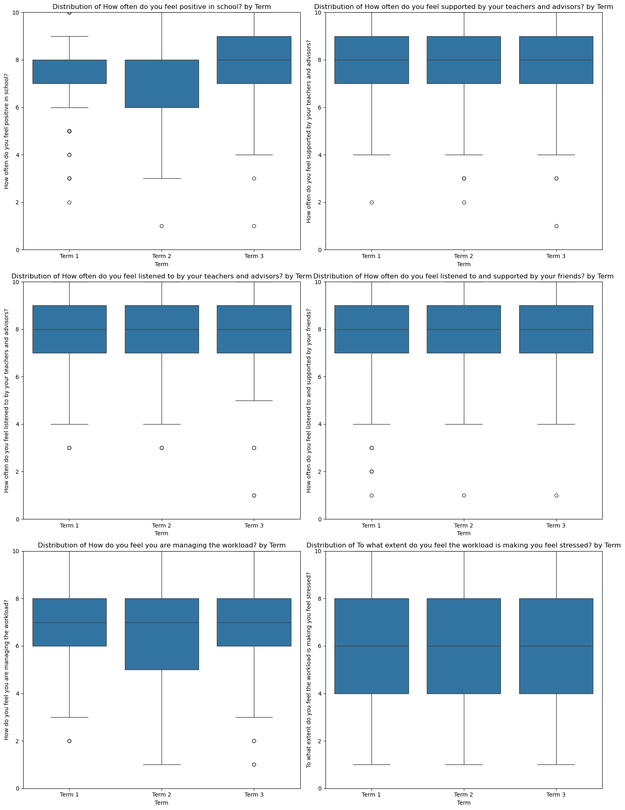

.. code:: ipython3

    import pandas as pd
    import numpy as np
    import matplotlib.pyplot as plt
    import seaborn as sns
    from scipy import stats
    import statsmodels.api as sm
    from statsmodels.formula.api import ols

.. code:: ipython3

    # Import necessary libraries
    import pandas as pd
    import numpy as np
    import matplotlib.pyplot as plt
    import seaborn as sns
    from scipy import stats
    import statsmodels.api as sm
    from statsmodels.formula.api import ols
    from statsmodels.stats.multicomp import pairwise_tukeyhsd
    
    # Set the display options
    pd.set_option('display.max_columns', None)
    pd.set_option('display.width', 1000)
    
    # Load the data
    file_path = "D:/Wellbeing Survey Project/comined_terms.xlsx"
    df = pd.read_excel(file_path, sheet_name='Sheet1')
    
    # Select the columns we're interested in
    target_columns = [
        'How often do you feel positive in school?',
        'How often do you feel supported by your teachers and advisors?',
        'How often do you feel listened to by your teachers and advisors?',
        'How often do you feel listened to and supported by your friends?',
        'How do you feel you are managing the workload?',
        'To what extent do you feel the workload is making you feel stressed?'
    ]
    
    # Filter the dataframe to only include our target terms and columns
    terms_df = df[df['Term'].isin(['Term 1', 'Term 2', 'Term 3'])].copy()
    
    # Convert term to categorical with proper ordering
    terms_df['Term'] = pd.Categorical(terms_df['Term'], categories=['Term 1', 'Term 2', 'Term 3'], ordered=True)
    
    # Clean the data - remove rows with missing values in our target columns
    clean_df = terms_df.dropna(subset=target_columns)
    
    # Display basic info about the data
    print(f"Total records: {len(clean_df)}")
    print("\nRecords per term:")
    print(clean_df['Term'].value_counts().sort_index())
    
    # 1. Descriptive Statistics
    print("\nDescriptive Statistics by Term:")
    desc_stats = clean_df.groupby('Term')[target_columns].describe()
    print(desc_stats)
    
    # 2. Visualization - Boxplots for each metric by term
    plt.figure(figsize=(15, 20))
    for i, col in enumerate(target_columns, 1):
        plt.subplot(3, 2, i)
        sns.boxplot(x='Term', y=col, data=clean_df)
        plt.title(f'Distribution of {col} by Term')
        plt.ylim(0, 10)  # Assuming scale is 1-10
    plt.tight_layout()
    plt.show()
    
    # 3. One-way ANOVA for each metric
    results = {}
    
    for col in target_columns:
        # One-way ANOVA
        term_groups = [clean_df[clean_df['Term'] == term][col] for term in ['Term 1', 'Term 2', 'Term 3']]
        f_val, p_val = stats.f_oneway(*term_groups)
        
        # Store results
        results[col] = {
            'F-value': f_val,
            'p-value': p_val,
            'Term 1 Mean': term_groups[0].mean(),
            'Term 2 Mean': term_groups[1].mean(),
            'Term 3 Mean': term_groups[2].mean(),
            'Term 1 Std': term_groups[0].std(),
            'Term 2 Std': term_groups[1].std(),
            'Term 3 Std': term_groups[2].std()
        }
        
        # Print results
        print(f"\nANOVA for {col}:")
        print(f"F-value: {f_val:.4f}, p-value: {p_val:.4f}")
        print(f"Term 1 - Mean: {term_groups[0].mean():.2f} ± {term_groups[0].std():.2f}")
        print(f"Term 2 - Mean: {term_groups[1].mean():.2f} ± {term_groups[1].std():.2f}")
        print(f"Term 3 - Mean: {term_groups[2].mean():.2f} ± {term_groups[2].std():.2f}")
        
        if p_val < 0.05:
            print("Significant difference between terms!")
            
            # Perform post-hoc Tukey test if ANOVA is significant
            print("\nPost-hoc Tukey HSD test:")
            tukey = pairwise_tukeyhsd(endog=clean_df[col],
                                     groups=clean_df['Term'],
                                     alpha=0.05)
            print(tukey)
        else:
            print("No significant difference between terms.")
    
    # 4. Create a summary DataFrame of results
    results_df = pd.DataFrame(results).T
    results_df['Significant'] = results_df['p-value'] < 0.05
    print("\nSummary of ANOVA Results:")
    print(results_df)
    
    # 5. Visualize significant differences
    sig_cols = results_df[results_df['Significant']].index
    
    plt.figure(figsize=(12, 8))
    for i, col in enumerate(sig_cols, 1):
        plt.subplot(2, 2, i)
        sns.barplot(x='Term', y=col, data=clean_df, ci='sd', capsize=0.1)
        plt.title(f'{col}')
        plt.ylabel('Average Rating')
        plt.ylim(0, 10)
    plt.tight_layout()
    plt.show()
    
    # 6. Additional analysis - Two-way ANOVA with School Level
    for col in target_columns:
        print(f"\nTwo-way ANOVA for {col} (Term × SchoolLevel):")
        model = ols(f'{col} ~ C(Term) + C(SchoolLevel) + C(Term):C(SchoolLevel)', data=clean_df).fit()
        anova_table = sm.stats.anova_lm(model, typ=2)
        print(anova_table)
        
        # Check for significant interaction
        if anova_table['PR(>F)']['C(Term):C(SchoolLevel)'] < 0.05:
            print("\nSignificant interaction effect found! Analyzing separately by SchoolLevel:")
            
            # Analyze middle school separately
            ms_df = clean_df[clean_df['SchoolLevel'] == 'Middle School']
            print("\nMiddle School:")
            ms_groups = [ms_df[ms_df['Term'] == term][col] for term in ['Term 1', 'Term 2', 'Term 3']]
            f_val, p_val = stats.f_oneway(*ms_groups)
            print(f"F-value: {f_val:.4f}, p-value: {p_val:.4f}")
            if p_val < 0.05:
                tukey = pairwise_tukeyhsd(endog=ms_df[col],
                                         groups=ms_df['Term'],
                                         alpha=0.05)
                print(tukey)
            
            # Analyze high school separately
            hs_df = clean_df[clean_df['SchoolLevel'] == 'High School']
            print("\nHigh School:")
            hs_groups = [hs_df[hs_df['Term'] == term][col] for term in ['Term 1', 'Term 2', 'Term 3']]
            f_val, p_val = stats.f_oneway(*hs_groups)
            print(f"F-value: {f_val:.4f}, p-value: {p_val:.4f}")
            if p_val < 0.05:
                tukey = pairwise_tukeyhsd(endog=hs_df[col],
                                         groups=hs_df['Term'],
                                         alpha=0.05)
                print(tukey)

.. parsed-literal::

    Total records: 464
    
    Records per term:
    Term
    Term 1    173
    Term 2    169
    Term 3    122
    Name: count, dtype: int64
    
    Descriptive Statistics by Term:
           How often do you feel positive in school?                                               How often do you feel supported by your teachers and advisors?                                               How often do you feel listened to by your teachers and advisors?                                               How often do you feel listened to and supported by your friends?                                               How do you feel you are managing the workload?                                               To what extent do you feel the workload is making you feel stressed?                                              
                                               count      mean       std  min  25%  50%  75%   max                                                          count      mean       std  min  25%  50%  75%   max                                                            count      mean       std  min  25%  50%  75%   max                                                            count      mean       std  min  25%  50%  75%   max                                          count      mean       std  min  25%  50%  75%   max                                                                count      mean       std  min  25%  50%  75%   max
    Term                                                                                                                                                                                                                                                                                                                                                                                                                                                                                                                                                                                                                                                     
    Term 1                                     173.0  7.364162  1.588582  2.0  7.0  8.0  8.0  10.0                                              173.0              8.115607  1.505200  2.0  7.0  8.0  9.0  10.0                                              173.0                8.063584  1.555748  3.0  7.0  8.0  9.0  10.0                                              173.0                7.901734  1.906735  1.0  7.0  8.0  9.0  10.0                                          173.0  6.728324  1.775530  2.0  6.0  7.0  8.0  10.0                                              173.0                    5.728324  2.389696  1.0  4.0  6.0  8.0  10.0
    Term 2                                     169.0  7.289941  1.590135  1.0  6.0  8.0  8.0  10.0                                              169.0              7.934911  1.640782  2.0  7.0  8.0  9.0  10.0                                              169.0                7.970414  1.638183  3.0  7.0  8.0  9.0  10.0                                              169.0                7.964497  1.606881  1.0  7.0  8.0  9.0  10.0                                          169.0  6.479290  1.933689  1.0  5.0  7.0  8.0  10.0                                              169.0                    5.668639  2.352106  1.0  4.0  6.0  8.0  10.0
    Term 3                                     122.0  7.860656  1.450651  1.0  7.0  8.0  9.0  10.0                                              122.0              8.057377  1.682674  1.0  7.0  8.0  9.0  10.0                                              122.0                8.049180  1.650707  1.0  7.0  8.0  9.0  10.0                                              122.0                8.073770  1.591133  1.0  7.0  8.0  9.0  10.0                                          122.0  7.008197  1.917712  1.0  6.0  7.0  8.0  10.0                                              122.0                    6.090164  2.321314  1.0  4.0  6.0  8.0  10.0
    

.. parsed-literal::

    C:\Users\Admin\AppData\Local\Temp\ipykernel_16872\366856566.py:45: FutureWarning: The default of observed=False is deprecated and will be changed to True in a future version of pandas. Pass observed=False to retain current behavior or observed=True to adopt the future default and silence this warning.
      desc_stats = clean_df.groupby('Term')[target_columns].describe()
    

.. parsed-literal::

    
    ANOVA for How often do you feel positive in school?:
    F-value: 5.3891, p-value: 0.0049
    Term 1 - Mean: 7.36 ± 1.59
    Term 2 - Mean: 7.29 ± 1.59
    Term 3 - Mean: 7.86 ± 1.45
    Significant difference between terms!
    
    Post-hoc Tukey HSD test:
    Multiple Comparison of Means - Tukey HSD, FWER=0.05
    ===================================================
    group1 group2 meandiff p-adj   lower  upper  reject
    ---------------------------------------------------
    Term 1 Term 2  -0.0742 0.8981 -0.4694  0.321  False
    Term 1 Term 3   0.4965 0.0195  0.0645 0.9285   True
    Term 2 Term 3   0.5707  0.006  0.1366 1.0048   True
    ---------------------------------------------------
    
    ANOVA for How often do you feel supported by your teachers and advisors?:
    F-value: 0.5600, p-value: 0.5716
    Term 1 - Mean: 8.12 ± 1.51
    Term 2 - Mean: 7.93 ± 1.64
    Term 3 - Mean: 8.06 ± 1.68
    No significant difference between terms.
    
    ANOVA for How often do you feel listened to by your teachers and advisors?:
    F-value: 0.1602, p-value: 0.8520
    Term 1 - Mean: 8.06 ± 1.56
    Term 2 - Mean: 7.97 ± 1.64
    Term 3 - Mean: 8.05 ± 1.65
    No significant difference between terms.
    
    ANOVA for How often do you feel listened to and supported by your friends?:
    F-value: 0.3587, p-value: 0.6988
    Term 1 - Mean: 7.90 ± 1.91
    Term 2 - Mean: 7.96 ± 1.61
    Term 3 - Mean: 8.07 ± 1.59
    No significant difference between terms.
    
    ANOVA for How do you feel you are managing the workload?:
    F-value: 2.8397, p-value: 0.0595
    Term 1 - Mean: 6.73 ± 1.78
    Term 2 - Mean: 6.48 ± 1.93
    Term 3 - Mean: 7.01 ± 1.92
    No significant difference between terms.
    
    ANOVA for To what extent do you feel the workload is making you feel stressed?:
    F-value: 1.2655, p-value: 0.2831
    Term 1 - Mean: 5.73 ± 2.39
    Term 2 - Mean: 5.67 ± 2.35
    Term 3 - Mean: 6.09 ± 2.32
    No significant difference between terms.
    
    Summary of ANOVA Results:
                                                         F-value   p-value  Term 1 Mean  Term 2 Mean  Term 3 Mean  Term 1 Std  Term 2 Std  Term 3 Std  Significant
    How often do you feel positive in school?           5.389096  0.004858     7.364162     7.289941     7.860656    1.588582    1.590135    1.450651         True
    How often do you feel supported by your teacher...  0.560022  0.571584     8.115607     7.934911     8.057377    1.505200    1.640782    1.682674        False
    How often do you feel listened to by your teach...  0.160250  0.851978     8.063584     7.970414     8.049180    1.555748    1.638183    1.650707        False
    How often do you feel listened to and supported...  0.358728  0.698759     7.901734     7.964497     8.073770    1.906735    1.606881    1.591133        False
    How do you feel you are managing the workload?      2.839683  0.059467     6.728324     6.479290     7.008197    1.775530    1.933689    1.917712        False
    To what extent do you feel the workload is maki...  1.265517  0.283072     5.728324     5.668639     6.090164    2.389696    2.352106    2.321314        False
    

.. parsed-literal::

    C:\Users\Admin\AppData\Local\Temp\ipykernel_16872\366856566.py:109: FutureWarning: 
    
    The `ci` parameter is deprecated. Use `errorbar='sd'` for the same effect.
    
      sns.barplot(x='Term', y=col, data=clean_df, ci='sd', capsize=0.1)
    

.. parsed-literal::

    
    Two-way ANOVA for How often do you feel positive in school? (Term × SchoolLevel):
    

::

    Traceback (most recent call last):
    

      File ~\AppData\Roaming\Python\Python312\site-packages\IPython\core\interactiveshell.py:3667 in run_code
        exec(code_obj, self.user_global_ns, self.user_ns)
    

      Cell In[3], line 119
        model = ols(f'{col} ~ C(Term) + C(SchoolLevel) + C(Term):C(SchoolLevel)', data=clean_df).fit()
    

      File ~\anaconda3\Lib\site-packages\statsmodels\base\model.py:203 in from_formula
        tmp = handle_formula_data(data, None, formula, depth=eval_env,
    

      File ~\anaconda3\Lib\site-packages\statsmodels\formula\formulatools.py:63 in handle_formula_data
        result = dmatrices(formula, Y, depth, return_type='dataframe',
    

      File ~\anaconda3\Lib\site-packages\patsy\highlevel.py:309 in dmatrices
        (lhs, rhs) = _do_highlevel_design(formula_like, data, eval_env,
    

      File ~\anaconda3\Lib\site-packages\patsy\highlevel.py:164 in _do_highlevel_design
        design_infos = _try_incr_builders(formula_like, data_iter_maker, eval_env,
    

      File ~\anaconda3\Lib\site-packages\patsy\highlevel.py:66 in _try_incr_builders
        return design_matrix_builders([formula_like.lhs_termlist,
    

      File ~\anaconda3\Lib\site-packages\patsy\build.py:689 in design_matrix_builders
        factor_states = _factors_memorize(all_factors, data_iter_maker, eval_env)
    

      File ~\anaconda3\Lib\site-packages\patsy\build.py:354 in _factors_memorize
        which_pass = factor.memorize_passes_needed(state, eval_env)
    

      File ~\anaconda3\Lib\site-packages\patsy\eval.py:478 in memorize_passes_needed
        subset_names = [name for name in ast_names(self.code)
    

      File ~\anaconda3\Lib\site-packages\patsy\eval.py:109 in ast_names
        for node in ast.walk(ast.parse(code)):
    

      File ~\anaconda3\Lib\ast.py:52 in parse
        return compile(source, filename, mode, flags,
    

      File <unknown>:1
        How often do you feel positive in school?
            ^
    SyntaxError: invalid syntax
    

.. code:: ipython3

    # Import necessary libraries
    import pandas as pd
    import numpy as np
    import matplotlib.pyplot as plt
    import seaborn as sns
    from scipy import stats
    import statsmodels.api as sm
    from statsmodels.formula.api import ols
    from statsmodels.stats.multicomp import pairwise_tukeyhsd
    
    # Set the display options
    pd.set_option('display.max_columns', None)
    pd.set_option('display.width', 1000)
    
    # Load the data
    file_path = "D:/Wellbeing Survey Project/comined_terms.xlsx"
    df = pd.read_excel(file_path, sheet_name='Sheet1')
    
    # Clean column names by removing special characters and making them valid Python identifiers
    df.columns = [col.replace('?', '').replace(' ', '_').strip() for col in df.columns]
    
    # Select the columns we're interested in (using cleaned names)
    target_columns = [
        'How_often_do_you_feel_positive_in_school',
        'How_often_do_you_feel_supported_by_your_teachers_and_advisors',
        'How_often_do_you_feel_listened_to_by_your_teachers_and_advisors',
        'How_often_do_you_feel_listened_to_and_supported_by_your_friends',
        'How_do_you_feel_you_are_managing_the_workload',
        'To_what_extent_do_you_feel_the_workload_is_making_you_feel_stressed'
    ]
    
    # Filter the dataframe to only include our target terms and columns
    terms_df = df[df['Term'].isin(['Term 1', 'Term 2', 'Term 3'])].copy()
    
    # Convert term to categorical with proper ordering
    terms_df['Term'] = pd.Categorical(terms_df['Term'], categories=['Term 1', 'Term 2', 'Term 3'], ordered=True)
    
    # Clean the data - remove rows with missing values in our target columns
    clean_df = terms_df.dropna(subset=target_columns)
    
    # Display basic info about the data
    print(f"Total records: {len(clean_df)}")
    print("\nRecords per term:")
    print(clean_df['Term'].value_counts().sort_index())
    
    # 1. Descriptive Statistics
    print("\nDescriptive Statistics by Term:")
    desc_stats = clean_df.groupby('Term', observed=True)[target_columns].describe()
    print(desc_stats)
    
    # 2. Visualization - Boxplots for each metric by term
    plt.figure(figsize=(15, 20))
    for i, col in enumerate(target_columns, 1):
        plt.subplot(3, 2, i)
        sns.boxplot(x='Term', y=col, data=clean_df)
        plt.title(f'Distribution of {col.replace("_", " ")} by Term')
        plt.ylim(0, 10)  # Assuming scale is 1-10
        plt.ylabel('Rating')
    plt.tight_layout()
    plt.show()
    
    # 3. One-way ANOVA for each metric
    results = {}
    
    for col in target_columns:
        # One-way ANOVA
        term_groups = [clean_df[clean_df['Term'] == term][col] for term in ['Term 1', 'Term 2', 'Term 3']]
        f_val, p_val = stats.f_oneway(*term_groups)
        
        # Store results
        results[col] = {
            'F-value': f_val,
            'p-value': p_val,
            'Term 1 Mean': term_groups[0].mean(),
            'Term 2 Mean': term_groups[1].mean(),
            'Term 3 Mean': term_groups[2].mean(),
            'Term 1 Std': term_groups[0].std(),
            'Term 2 Std': term_groups[1].std(),
            'Term 3 Std': term_groups[2].std()
        }
        
        # Print results
        print(f"\nANOVA for {col.replace('_', ' ')}:")
        print(f"F-value: {f_val:.4f}, p-value: {p_val:.4f}")
        print(f"Term 1 - Mean: {term_groups[0].mean():.2f} ± {term_groups[0].std():.2f}")
        print(f"Term 2 - Mean: {term_groups[1].mean():.2f} ± {term_groups[1].std():.2f}")
        print(f"Term 3 - Mean: {term_groups[2].mean():.2f} ± {term_groups[2].std():.2f}")
        
        if p_val < 0.05:
            print("Significant difference between terms!")
            
            # Perform post-hoc Tukey test if ANOVA is significant
            print("\nPost-hoc Tukey HSD test:")
            tukey = pairwise_tukeyhsd(endog=clean_df[col],
                                     groups=clean_df['Term'],
                                     alpha=0.05)
            print(tukey)
            
            # Plot the results
            plt.figure(figsize=(8, 5))
            tukey.plot_simultaneous()
            plt.title(f"Tukey HSD Results for {col.replace('_', ' ')}")
            plt.show()
        else:
            print("No significant difference between terms.")
    
    # 4. Create a summary DataFrame of results
    results_df = pd.DataFrame(results).T
    results_df['Significant'] = results_df['p-value'] < 0.05
    print("\nSummary of ANOVA Results:")
    print(results_df)
    
    # 5. Visualize significant differences
    sig_cols = results_df[results_df['Significant']].index
    
    if len(sig_cols) > 0:
        plt.figure(figsize=(12, 8))
        for i, col in enumerate(sig_cols, 1):
            plt.subplot(2, 2, i)
            sns.barplot(x='Term', y=col, data=clean_df, errorbar='sd', capsize=0.1)
            plt.title(f'{col.replace("_", " ")}')
            plt.ylabel('Average Rating')
            plt.ylim(0, 10)
        plt.tight_layout()
        plt.show()
    else:
        print("\nNo significant differences found in any metrics.")
    
    # 6. Additional analysis - Two-way ANOVA with School Level
    if 'SchoolLevel' in clean_df.columns:
        for col in target_columns:
            print(f"\nTwo-way ANOVA for {col.replace('_', ' ')} (Term × SchoolLevel):")
            try:
                # Create a formula-safe column name
                safe_col = col.replace(' ', '_').replace('?', '')
                
                model = ols(f'{safe_col} ~ C(Term) + C(SchoolLevel) + C(Term):C(SchoolLevel)', 
                           data=clean_df).fit()
                anova_table = sm.stats.anova_lm(model, typ=2)
                print(anova_table)
                
                # Check for significant interaction
                if 'C(Term):C(SchoolLevel)' in anova_table.index:
                    if anova_table.loc['C(Term):C(SchoolLevel)', 'PR(>F)'] < 0.05:
                        print("\nSignificant interaction effect found! Analyzing separately by SchoolLevel:")
                        
                        # Analyze middle school separately
                        if 'Middle School' in clean_df['SchoolLevel'].unique():
                            ms_df = clean_df[clean_df['SchoolLevel'] == 'Middle School']
                            print("\nMiddle School:")
                            ms_groups = [ms_df[ms_df['Term'] == term][col] for term in ['Term 1', 'Term 2', 'Term 3']]
                            f_val, p_val = stats.f_oneway(*ms_groups)
                            print(f"F-value: {f_val:.4f}, p-value: {p_val:.4f}")
                            if p_val < 0.05:
                                tukey = pairwise_tukeyhsd(endog=ms_df[col],
                                                         groups=ms_df['Term'],
                                                         alpha=0.05)
                                print(tukey)
                        
                        # Analyze high school separately
                        if 'High School' in clean_df['SchoolLevel'].unique():
                            hs_df = clean_df[clean_df['SchoolLevel'] == 'High School']
                            print("\nHigh School:")
                            hs_groups = [hs_df[hs_df['Term'] == term][col] for term in ['Term 1', 'Term 2', 'Term 3']]
                            f_val, p_val = stats.f_oneway(*hs_groups)
                            print(f"F-value: {f_val:.4f}, p-value: {p_val:.4f}")
                            if p_val < 0.05:
                                tukey = pairwise_tukeyhsd(endog=hs_df[col],
                                                         groups=hs_df['Term'],
                                                         alpha=0.05)
                                print(tukey)
            except Exception as e:
                print(f"Error analyzing {col}: {str(e)}")
    else:
        print("\nSchoolLevel column not found in data. Skipping two-way ANOVA.")

.. parsed-literal::

    Total records: 464
    
    Records per term:
    Term
    Term 1    173
    Term 2    169
    Term 3    122
    Name: count, dtype: int64
    
    Descriptive Statistics by Term:
           How_often_do_you_feel_positive_in_school                                               How_often_do_you_feel_supported_by_your_teachers_and_advisors                                               How_often_do_you_feel_listened_to_by_your_teachers_and_advisors                                               How_often_do_you_feel_listened_to_and_supported_by_your_friends                                               How_do_you_feel_you_are_managing_the_workload                                               To_what_extent_do_you_feel_the_workload_is_making_you_feel_stressed                                              
                                              count      mean       std  min  25%  50%  75%   max                                                         count      mean       std  min  25%  50%  75%   max                                                           count      mean       std  min  25%  50%  75%   max                                                           count      mean       std  min  25%  50%  75%   max                                         count      mean       std  min  25%  50%  75%   max                                                               count      mean       std  min  25%  50%  75%   max
    Term                                                                                                                                                                                                                                                                                                                                                                                                                                                                                                                                                                                                                                               
    Term 1                                    173.0  7.364162  1.588582  2.0  7.0  8.0  8.0  10.0                                              173.0             8.115607  1.505200  2.0  7.0  8.0  9.0  10.0                                              173.0               8.063584  1.555748  3.0  7.0  8.0  9.0  10.0                                              173.0               7.901734  1.906735  1.0  7.0  8.0  9.0  10.0                                         173.0  6.728324  1.775530  2.0  6.0  7.0  8.0  10.0                                              173.0                   5.728324  2.389696  1.0  4.0  6.0  8.0  10.0
    Term 2                                    169.0  7.289941  1.590135  1.0  6.0  8.0  8.0  10.0                                              169.0             7.934911  1.640782  2.0  7.0  8.0  9.0  10.0                                              169.0               7.970414  1.638183  3.0  7.0  8.0  9.0  10.0                                              169.0               7.964497  1.606881  1.0  7.0  8.0  9.0  10.0                                         169.0  6.479290  1.933689  1.0  5.0  7.0  8.0  10.0                                              169.0                   5.668639  2.352106  1.0  4.0  6.0  8.0  10.0
    Term 3                                    122.0  7.860656  1.450651  1.0  7.0  8.0  9.0  10.0                                              122.0             8.057377  1.682674  1.0  7.0  8.0  9.0  10.0                                              122.0               8.049180  1.650707  1.0  7.0  8.0  9.0  10.0                                              122.0               8.073770  1.591133  1.0  7.0  8.0  9.0  10.0                                         122.0  7.008197  1.917712  1.0  6.0  7.0  8.0  10.0                                              122.0                   6.090164  2.321314  1.0  4.0  6.0  8.0  10.0
    

.. parsed-literal::

    
    ANOVA for How often do you feel positive in school:
    F-value: 5.3891, p-value: 0.0049
    Term 1 - Mean: 7.36 ± 1.59
    Term 2 - Mean: 7.29 ± 1.59
    Term 3 - Mean: 7.86 ± 1.45
    Significant difference between terms!
    
    Post-hoc Tukey HSD test:
    Multiple Comparison of Means - Tukey HSD, FWER=0.05
    ===================================================
    group1 group2 meandiff p-adj   lower  upper  reject
    ---------------------------------------------------
    Term 1 Term 2  -0.0742 0.8981 -0.4694  0.321  False
    Term 1 Term 3   0.4965 0.0195  0.0645 0.9285   True
    Term 2 Term 3   0.5707  0.006  0.1366 1.0048   True
    ---------------------------------------------------
    

.. parsed-literal::

    <Figure size 800x500 with 0 Axes>

.. parsed-literal::

    
    ANOVA for How often do you feel supported by your teachers and advisors:
    F-value: 0.5600, p-value: 0.5716
    Term 1 - Mean: 8.12 ± 1.51
    Term 2 - Mean: 7.93 ± 1.64
    Term 3 - Mean: 8.06 ± 1.68
    No significant difference between terms.
    
    ANOVA for How often do you feel listened to by your teachers and advisors:
    F-value: 0.1602, p-value: 0.8520
    Term 1 - Mean: 8.06 ± 1.56
    Term 2 - Mean: 7.97 ± 1.64
    Term 3 - Mean: 8.05 ± 1.65
    No significant difference between terms.
    
    ANOVA for How often do you feel listened to and supported by your friends:
    F-value: 0.3587, p-value: 0.6988
    Term 1 - Mean: 7.90 ± 1.91
    Term 2 - Mean: 7.96 ± 1.61
    Term 3 - Mean: 8.07 ± 1.59
    No significant difference between terms.
    
    ANOVA for How do you feel you are managing the workload:
    F-value: 2.8397, p-value: 0.0595
    Term 1 - Mean: 6.73 ± 1.78
    Term 2 - Mean: 6.48 ± 1.93
    Term 3 - Mean: 7.01 ± 1.92
    No significant difference between terms.
    
    ANOVA for To what extent do you feel the workload is making you feel stressed:
    F-value: 1.2655, p-value: 0.2831
    Term 1 - Mean: 5.73 ± 2.39
    Term 2 - Mean: 5.67 ± 2.35
    Term 3 - Mean: 6.09 ± 2.32
    No significant difference between terms.
    
    Summary of ANOVA Results:
                                                         F-value   p-value  Term 1 Mean  Term 2 Mean  Term 3 Mean  Term 1 Std  Term 2 Std  Term 3 Std  Significant
    How_often_do_you_feel_positive_in_school            5.389096  0.004858     7.364162     7.289941     7.860656    1.588582    1.590135    1.450651         True
    How_often_do_you_feel_supported_by_your_teacher...  0.560022  0.571584     8.115607     7.934911     8.057377    1.505200    1.640782    1.682674        False
    How_often_do_you_feel_listened_to_by_your_teach...  0.160250  0.851978     8.063584     7.970414     8.049180    1.555748    1.638183    1.650707        False
    How_often_do_you_feel_listened_to_and_supported...  0.358728  0.698759     7.901734     7.964497     8.073770    1.906735    1.606881    1.591133        False
    How_do_you_feel_you_are_managing_the_workload       2.839683  0.059467     6.728324     6.479290     7.008197    1.775530    1.933689    1.917712        False
    To_what_extent_do_you_feel_the_workload_is_maki...  1.265517  0.283072     5.728324     5.668639     6.090164    2.389696    2.352106    2.321314        False
    

.. parsed-literal::

    
    Two-way ANOVA for How often do you feel positive in school (Term × SchoolLevel):
                                 sum_sq     df         F    PR(>F)
    C(Term)                   26.121379    2.0  5.469289  0.004494
    C(SchoolLevel)             0.185566    1.0  0.077708  0.780554
    C(Term):C(SchoolLevel)    19.590069    2.0  4.101765  0.017155
    Residual                1093.706215  458.0       NaN       NaN
    
    Significant interaction effect found! Analyzing separately by SchoolLevel:
    
    Middle School:
    F-value: 2.3384, p-value: 0.0986
    
    High School:
    F-value: 7.5593, p-value: 0.0007
    Multiple Comparison of Means - Tukey HSD, FWER=0.05
    ===================================================
    group1 group2 meandiff p-adj   lower  upper  reject
    ---------------------------------------------------
    Term 1 Term 2   0.2621 0.4982 -0.2867 0.8108  False
    Term 1 Term 3   1.1185 0.0004  0.4358 1.8011   True
    Term 2 Term 3   0.8564 0.0107  0.1646 1.5482   True
    ---------------------------------------------------
    
    Two-way ANOVA for How often do you feel supported by your teachers and advisors (Term × SchoolLevel):
                                 sum_sq     df         F    PR(>F)
    C(Term)                    2.905337    2.0  0.573437  0.563989
    C(SchoolLevel)             1.063902    1.0  0.419972  0.517276
    C(Term):C(SchoolLevel)    23.270611    2.0  4.593006  0.010593
    Residual                1160.235733  458.0       NaN       NaN
    
    Significant interaction effect found! Analyzing separately by SchoolLevel:
    
    Middle School:
    F-value: 3.4795, p-value: 0.0323
    Multiple Comparison of Means - Tukey HSD, FWER=0.05 
    ====================================================
    group1 group2 meandiff p-adj   lower   upper  reject
    ----------------------------------------------------
    Term 1 Term 2  -0.6855  0.024 -1.2983 -0.0728   True
    Term 1 Term 3  -0.3372 0.4106 -0.9607  0.2863  False
    Term 2 Term 3   0.3483  0.381   -0.27  0.9667  False
    ----------------------------------------------------
    
    High School:
    F-value: 1.4009, p-value: 0.2488
    
    Two-way ANOVA for How often do you feel listened to by your teachers and advisors (Term × SchoolLevel):
                                 sum_sq     df         F    PR(>F)
    C(Term)                    1.143094    2.0  0.220755  0.801998
    C(SchoolLevel)             7.997651    1.0  3.089025  0.079490
    C(Term):C(SchoolLevel)     3.073522    2.0  0.593561  0.552781
    Residual                1185.786395  458.0       NaN       NaN
    
    Two-way ANOVA for How often do you feel listened to and supported by your friends (Term × SchoolLevel):
                                 sum_sq     df         F    PR(>F)
    C(Term)                    4.097578    2.0  0.695167  0.499517
    C(SchoolLevel)            15.398529    1.0  5.224815  0.022723
    C(Term):C(SchoolLevel)     0.240490    2.0  0.040800  0.960025
    Residual                1349.813509  458.0       NaN       NaN
    
    Two-way ANOVA for How do you feel you are managing the workload (Term × SchoolLevel):
                                 sum_sq     df         F    PR(>F)
    C(Term)                   22.051355    2.0  3.152702  0.043665
    C(SchoolLevel)             5.135337    1.0  1.468407  0.226222
    C(Term):C(SchoolLevel)     8.540573    2.0  1.221053  0.295878
    Residual                1601.724622  458.0       NaN       NaN
    
    Two-way ANOVA for To what extent do you feel the workload is making you feel stressed (Term × SchoolLevel):
                                 sum_sq     df         F    PR(>F)
    C(Term)                   16.063544    2.0  1.442481  0.237412
    C(SchoolLevel)             4.179947    1.0  0.750706  0.386707
    C(Term):C(SchoolLevel)     9.347687    2.0  0.839408  0.432630
    Residual                2550.155564  458.0       NaN       NaN
    

.. code:: ipython3

    # Import necessary libraries
    import pandas as pd
    import numpy as np
    import matplotlib.pyplot as plt
    import seaborn as sns
    from scipy import stats
    from IPython.display import display
    
    # Set up display options
    pd.set_option('display.max_columns', None)
    pd.set_option('display.width', 1000)
    sns.set_style("whitegrid")  # Use seaborn's whitegrid style
    
    # Load and prepare data
    file_path = "D:/Wellbeing Survey Project/comined_terms.xlsx"
    try:
        df = pd.read_excel(file_path, sheet_name='Sheet1')
    except FileNotFoundError:
        print(f"Error: File not found at {file_path}")
        print("Please verify the file path and try again.")
        raise
    
    # Clean column names
    df.columns = [col.replace('?', '').replace(' ', '_').strip() for col in df.columns]
    
    # Target columns
    target_columns = [
        'How_often_do_you_feel_positive_in_school',
        'How_often_do_you_feel_supported_by_your_teachers_and_advisors',
        'How_often_do_you_feel_listened_to_by_your_teachers_and_advisors',
        'How_often_do_you_feel_listened_to_and_supported_by_your_friends',
        'How_do_you_feel_you_are_managing_the_workload',
        'To_what_extent_do_you_feel_the_workload_is_making_you_feel_stressed'
    ]
    
    # Filter and clean data
    terms_df = df[df['Term'].isin(['Term 1', 'Term 2', 'Term 3'])].copy()
    terms_df['Term'] = pd.Categorical(terms_df['Term'], categories=['Term 1', 'Term 2', 'Term 3'], ordered=True)
    clean_df = terms_df.dropna(subset=target_columns)
    
    # 1. Create formatted descriptive statistics tables
    def create_descriptive_table(data, columns, group_by='Term'):
        """Create a well-formatted descriptive statistics table"""
        desc = data.groupby(group_by, observed=True)[columns].describe()
        
        # Flatten the multi-index and create clean column names
        desc = desc.unstack().unstack(level=0).T
        desc.index.names = ['Statistic', 'Variable']
        
        # Select only the statistics we want to display
        stats_to_show = ['count', 'mean', 'std', 'min', '25%', '50%', '75%', 'max']
        desc = desc.loc[stats_to_show]
        
        # Format numbers
        desc = desc.applymap(lambda x: f"{x:.2f}" if isinstance(x, (int, float)) else x)
        
        return desc
    
    # Display descriptive tables
    print("\nDESCRIPTIVE STATISTICS BY TERM")
    desc_table = create_descriptive_table(clean_df, target_columns)
    display(desc_table)
    
    # 2. Create summary statistics table for easy comparison
    def create_summary_table(data, columns, group_by='Term'):
        """Create a summary table comparing terms"""
        summary = data.groupby(group_by, observed=True)[columns].agg(['mean', 'std', 'count'])
        summary = summary.stack().unstack(level=0)
        
        # Format numbers
        formatted_summary = summary.copy()
        for stat in ['mean', 'std']:
            formatted_summary[stat] = formatted_summary[stat].map('{:.2f}'.format)
        
        return formatted_summary
    
    # Display summary table
    print("\nSUMMARY STATISTICS COMPARISON")
    summary_table = create_summary_table(clean_df, target_columns)
    display(summary_table)
    
    # 3. Visualize mean differences with confidence intervals
    plt.figure(figsize=(14, 8))
    for i, col in enumerate(target_columns, 1):
        plt.subplot(2, 3, i)
        sns.pointplot(x='Term', y=col, data=clean_df, errorbar=('ci', 95), capsize=0.1)
        plt.title(col.replace('_', ' ')[:30] + ('...' if len(col) > 30 else ''))
        plt.ylim(0, 10)
        plt.ylabel('Rating (1-10)')
    plt.tight_layout()
    plt.show()
    
    # 4. ANOVA and post-hoc tests
    results = []
    for col in target_columns:
        term_groups = [clean_df[clean_df['Term'] == term][col] for term in ['Term 1', 'Term 2', 'Term 3']]
        f_val, p_val = stats.f_oneway(*term_groups)
        
        # Calculate effect size (eta squared)
        eta_sq = f_val * (len(term_groups)-1) / (f_val * (len(term_groups)-1) + (len(clean_df)-len(term_groups)))
        
        results.append({
            'Metric': col.replace('_', ' '),
            'F-value': f"{f_val:.2f}",
            'p-value': f"{p_val:.4f}",
            'Effect Size (η²)': f"{eta_sq:.3f}",
            'Term 1 Mean ± SD': f"{term_groups[0].mean():.2f} ± {term_groups[0].std():.2f}",
            'Term 2 Mean ± SD': f"{term_groups[1].mean():.2f} ± {term_groups[1].std():.2f}",
            'Term 3 Mean ± SD': f"{term_groups[2].mean():.2f} ± {term_groups[2].std():.2f}",
            'Significant': "Yes" if p_val < 0.05 else "No"
        })
    
    # Convert to DataFrame
    results_df = pd.DataFrame(results)
    
    # Display ANOVA results
    print("\nANOVA RESULTS ACROSS TERMS")
    display(results_df)
    
    # Add some space at the end
    print("\nAnalysis complete.")

.. parsed-literal::

    
    DESCRIPTIVE STATISTICS BY TERM
    

::

    ---------------------------------------------------------------------------

    ValueError                                Traceback (most recent call last)

    Cell In[15], line 61
         59 # Display descriptive tables
         60 print("\nDESCRIPTIVE STATISTICS BY TERM")
    ---> 61 desc_table = create_descriptive_table(clean_df, target_columns)
         62 display(desc_table)
         64 # 2. Create summary statistics table for easy comparison
    

    Cell In[15], line 48, in create_descriptive_table(data, columns, group_by)
         46 # Flatten the multi-index and create clean column names
         47 desc = desc.unstack().unstack(level=0).T
    ---> 48 desc.index.names = ['Statistic', 'Variable']
         50 # Select only the statistics we want to display
         51 stats_to_show = ['count', 'mean', 'std', 'min', '25%', '50%', '75%', 'max']
    

    File ~\anaconda3\Lib\site-packages\pandas\core\indexes\base.py:1787, in Index._set_names(self, values, level)
       1785     raise ValueError("Names must be a list-like")
       1786 if len(values) != 1:
    -> 1787     raise ValueError(f"Length of new names must be 1, got {len(values)}")
       1789 # GH 20527
       1790 # All items in 'name' need to be hashable:
       1791 validate_all_hashable(*values, error_name=f"{type(self).__name__}.name")
    

    ValueError: Length of new names must be 1, got 2

.. code:: ipython3

    # Import necessary libraries
    import pandas as pd
    import numpy as np
    import matplotlib.pyplot as plt
    import seaborn as sns
    import os
    from scipy import stats
    from IPython.display import display
    
    # Set up display options
    pd.set_option('display.max_columns', None)
    pd.set_option('display.width', 1000)
    sns.set_style("whitegrid")
    
    # Load and prepare data
    file_path = "D:/Wellbeing Survey Project/comined_terms.xlsx"
    try:
        df = pd.read_excel(file_path, sheet_name='Sheet1')
    except FileNotFoundError:
        print(f"Error: File not found at {file_path}")
        print("Please verify the file path and try again.")
        raise
    
    # Clean column names
    df.columns = [col.replace('?', '').replace(' ', '_').strip() for col in df.columns]
    
    # Target columns
    target_columns = [
        'How_often_do_you_feel_positive_in_school',
        'How_often_do_you_feel_supported_by_your_teachers_and_advisors',
        'How_often_do_you_feel_listened_to_by_your_teachers_and_advisors',
        'How_often_do_you_feel_listened_to_and_supported_by_your_friends',
        'How_do_you_feel_you_are_managing_the_workload',
        'To_what_extent_do_you_feel_the_workload_is_making_you_feel_stressed'
    ]
    
    # Filter and clean data
    terms_df = df[df['Term'].isin(['Term 1', 'Term 2', 'Term 3'])].copy()
    terms_df['Term'] = pd.Categorical(terms_df['Term'], categories=['Term 1', 'Term 2', 'Term 3'], ordered=True)
    clean_df = terms_df.dropna(subset=target_columns)
    
    # 1. Create formatted descriptive statistics tables
    def create_descriptive_table(data, columns, group_by='Term'):
        """Create a well-formatted descriptive statistics table"""
        # Calculate statistics for each term
        stats_list = []
        for term in ['Term 1', 'Term 2', 'Term 3']:
            term_data = data[data[group_by] == term][columns]
            stats = term_data.describe().T
            stats['Term'] = term
            stats_list.append(stats)
        
        # Combine all terms
        all_stats = pd.concat(stats_list)
        
        # Select and order the statistics we want
        stats_to_show = ['count', 'mean', 'std', 'min', '25%', '50%', '75%', 'max']
        all_stats = all_stats[stats_to_show + ['Term']]
        
        # Reset index to get Variable as a column
        all_stats.reset_index(inplace=True)
        all_stats.rename(columns={'index': 'Variable'}, inplace=True)
        
        # Format numbers
        for col in stats_to_show:
            all_stats[col] = all_stats[col].apply(lambda x: f"{x:.2f}" if isinstance(x, (int, float)) else x)
        
        # Pivot for better display
        pivot_df = all_stats.pivot(index='Variable', columns='Term', values=stats_to_show)
        
        # Flatten multi-index columns
        pivot_df.columns = [f"{stat} {term}" for term, stat in pivot_df.columns]
        
        return pivot_df
    
    # Display descriptive tables
    print("\nDESCRIPTIVE STATISTICS BY TERM")
    desc_table = create_descriptive_table(clean_df, target_columns)
    display(desc_table)
    
    # 2. Create summary statistics table for easy comparison
    def create_summary_table(data, columns, group_by='Term'):
        """Create a summary table comparing terms without MultiIndex issues."""
        summary = data.groupby(group_by, observed=True)[columns].agg(['mean', 'std', 'count'])
    
        # Swap levels to have (statistic, variable) for easier formatting
        summary = summary.swaplevel(axis=1).sort_index(axis=1, level=0)
    
        # Format numbers consistently
        for stat in ['mean', 'std']:
            for col in columns:
                summary[(stat, col)] = summary[(stat, col)].map('{:.2f}'.format)
    
        # Flatten columns for display
        summary.columns = [f"{stat} - {col}" for stat, col in summary.columns]
    
        return summary
    
    
    # Display summary table
    print("\nSUMMARY STATISTICS COMPARISON")
    summary_table = create_summary_table(clean_df, target_columns)
    display(summary_table)
    # Create output folder if it does not exist
    output_folder = "Wellbeing_Charts"
    os.makedirs(output_folder, exist_ok=True)
    # 3. Visualize mean differences with confidence intervals
    plt.figure(figsize=(14, 8))
    for i, col in enumerate(target_columns, 1):
        plt.subplot(2, 3, i)
        sns.pointplot(x='Term', y=col, data=clean_df, errorbar=('ci', 95), capsize=0.1)
        plt.title(col.replace('_', ' ')[:30] + ('...' if len(col) > 30 else ''))
        plt.ylim(0, 10)
        plt.ylabel('Rating (1-10)')
    plt.tight_layout()
    plt.savefig(wellbeing_viz)
    filename = f"{output_folder}/{level.replace(' ', '_')}_Wellbeing_Term_Comparison.png"
    plt.savefig(filename, dpi=300, bbox_inches='tight')
    plt.show()
    print(f"✅ Chart saved to {filename}")
    # 4. ANOVA and post-hoc tests
    results = []
    for col in target_columns:
        term_groups = [clean_df[clean_df['Term'] == term][col] for term in ['Term 1', 'Term 2', 'Term 3']]
        f_val, p_val = stats.f_oneway(*term_groups)
        
        # Calculate effect size (eta squared)
        eta_sq = f_val * (len(term_groups)-1) / (f_val * (len(term_groups)-1) + (len(clean_df)-len(term_groups)))
        
        results.append({
            'Metric': col.replace('_', ' '),
            'F-value': f"{f_val:.2f}",
            'p-value': f"{p_val:.4f}",
            'Effect Size (η²)': f"{eta_sq:.3f}",
            'Term 1 Mean ± SD': f"{term_groups[0].mean():.2f} ± {term_groups[0].std():.2f}",
            'Term 2 Mean ± SD': f"{term_groups[1].mean():.2f} ± {term_groups[1].std():.2f}",
            'Term 3 Mean ± SD': f"{term_groups[2].mean():.2f} ± {term_groups[2].std():.2f}",
            'Significant': "Yes" if p_val < 0.05 else "No"
        })
    
    # Convert to DataFrame
    results_df = pd.DataFrame(results)
    
    # Display ANOVA results
    print("\nANOVA RESULTS ACROSS TERMS")
    display(results_df)
    
    print("\nAnalysis complete.")

.. parsed-literal::

    
    DESCRIPTIVE STATISTICS BY TERM
    

.. raw:: html

    

    
    <table border="1" class="dataframe">
      <thead>
        <tr style="text-align: right;">
          <th></th>
          <th>Term 1 count</th>
          <th>Term 2 count</th>
          <th>Term 3 count</th>
          <th>Term 1 mean</th>
          <th>Term 2 mean</th>
          <th>Term 3 mean</th>
          <th>Term 1 std</th>
          <th>Term 2 std</th>
          <th>Term 3 std</th>
          <th>Term 1 min</th>
          <th>Term 2 min</th>
          <th>Term 3 min</th>
          <th>Term 1 25%</th>
          <th>Term 2 25%</th>
          <th>Term 3 25%</th>
          <th>Term 1 50%</th>
          <th>Term 2 50%</th>
          <th>Term 3 50%</th>
          <th>Term 1 75%</th>
          <th>Term 2 75%</th>
          <th>Term 3 75%</th>
          <th>Term 1 max</th>
          <th>Term 2 max</th>
          <th>Term 3 max</th>
        </tr>
        <tr>
          <th>Variable</th>
          <th></th>
          <th></th>
          <th></th>
          <th></th>
          <th></th>
          <th></th>
          <th></th>
          <th></th>
          <th></th>
          <th></th>
          <th></th>
          <th></th>
          <th></th>
          <th></th>
          <th></th>
          <th></th>
          <th></th>
          <th></th>
          <th></th>
          <th></th>
          <th></th>
          <th></th>
          <th></th>
          <th></th>
        </tr>
      </thead>
      <tbody>
        <tr>
          <th>How_do_you_feel_you_are_managing_the_workload</th>
          <td>173.00</td>
          <td>169.00</td>
          <td>122.00</td>
          <td>6.73</td>
          <td>6.48</td>
          <td>7.01</td>
          <td>1.78</td>
          <td>1.93</td>
          <td>1.92</td>
          <td>2.00</td>
          <td>1.00</td>
          <td>1.00</td>
          <td>6.00</td>
          <td>5.00</td>
          <td>6.00</td>
          <td>7.00</td>
          <td>7.00</td>
          <td>7.00</td>
          <td>8.00</td>
          <td>8.00</td>
          <td>8.00</td>
          <td>10.00</td>
          <td>10.00</td>
          <td>10.00</td>
        </tr>
        <tr>
          <th>How_often_do_you_feel_listened_to_and_supported_by_your_friends</th>
          <td>173.00</td>
          <td>169.00</td>
          <td>122.00</td>
          <td>7.90</td>
          <td>7.96</td>
          <td>8.07</td>
          <td>1.91</td>
          <td>1.61</td>
          <td>1.59</td>
          <td>1.00</td>
          <td>1.00</td>
          <td>1.00</td>
          <td>7.00</td>
          <td>7.00</td>
          <td>7.00</td>
          <td>8.00</td>
          <td>8.00</td>
          <td>8.00</td>
          <td>9.00</td>
          <td>9.00</td>
          <td>9.00</td>
          <td>10.00</td>
          <td>10.00</td>
          <td>10.00</td>
        </tr>
        <tr>
          <th>How_often_do_you_feel_listened_to_by_your_teachers_and_advisors</th>
          <td>173.00</td>
          <td>169.00</td>
          <td>122.00</td>
          <td>8.06</td>
          <td>7.97</td>
          <td>8.05</td>
          <td>1.56</td>
          <td>1.64</td>
          <td>1.65</td>
          <td>3.00</td>
          <td>3.00</td>
          <td>1.00</td>
          <td>7.00</td>
          <td>7.00</td>
          <td>7.00</td>
          <td>8.00</td>
          <td>8.00</td>
          <td>8.00</td>
          <td>9.00</td>
          <td>9.00</td>
          <td>9.00</td>
          <td>10.00</td>
          <td>10.00</td>
          <td>10.00</td>
        </tr>
        <tr>
          <th>How_often_do_you_feel_positive_in_school</th>
          <td>173.00</td>
          <td>169.00</td>
          <td>122.00</td>
          <td>7.36</td>
          <td>7.29</td>
          <td>7.86</td>
          <td>1.59</td>
          <td>1.59</td>
          <td>1.45</td>
          <td>2.00</td>
          <td>1.00</td>
          <td>1.00</td>
          <td>7.00</td>
          <td>6.00</td>
          <td>7.00</td>
          <td>8.00</td>
          <td>8.00</td>
          <td>8.00</td>
          <td>8.00</td>
          <td>8.00</td>
          <td>9.00</td>
          <td>10.00</td>
          <td>10.00</td>
          <td>10.00</td>
        </tr>
        <tr>
          <th>How_often_do_you_feel_supported_by_your_teachers_and_advisors</th>
          <td>173.00</td>
          <td>169.00</td>
          <td>122.00</td>
          <td>8.12</td>
          <td>7.93</td>
          <td>8.06</td>
          <td>1.51</td>
          <td>1.64</td>
          <td>1.68</td>
          <td>2.00</td>
          <td>2.00</td>
          <td>1.00</td>
          <td>7.00</td>
          <td>7.00</td>
          <td>7.00</td>
          <td>8.00</td>
          <td>8.00</td>
          <td>8.00</td>
          <td>9.00</td>
          <td>9.00</td>
          <td>9.00</td>
          <td>10.00</td>
          <td>10.00</td>
          <td>10.00</td>
        </tr>
        <tr>
          <th>To_what_extent_do_you_feel_the_workload_is_making_you_feel_stressed</th>
          <td>173.00</td>
          <td>169.00</td>
          <td>122.00</td>
          <td>5.73</td>
          <td>5.67</td>
          <td>6.09</td>
          <td>2.39</td>
          <td>2.35</td>
          <td>2.32</td>
          <td>1.00</td>
          <td>1.00</td>
          <td>1.00</td>
          <td>4.00</td>
          <td>4.00</td>
          <td>4.00</td>
          <td>6.00</td>
          <td>6.00</td>
          <td>6.00</td>
          <td>8.00</td>
          <td>8.00</td>
          <td>8.00</td>
          <td>10.00</td>
          <td>10.00</td>
          <td>10.00</td>
        </tr>
      </tbody>
    </table>
    

.. parsed-literal::

    
    SUMMARY STATISTICS COMPARISON
    

.. raw:: html

    

    
    <table border="1" class="dataframe">
      <thead>
        <tr style="text-align: right;">
          <th></th>
          <th>count - How_do_you_feel_you_are_managing_the_workload</th>
          <th>count - How_often_do_you_feel_listened_to_and_supported_by_your_friends</th>
          <th>count - How_often_do_you_feel_listened_to_by_your_teachers_and_advisors</th>
          <th>count - How_often_do_you_feel_positive_in_school</th>
          <th>count - How_often_do_you_feel_supported_by_your_teachers_and_advisors</th>
          <th>count - To_what_extent_do_you_feel_the_workload_is_making_you_feel_stressed</th>
          <th>mean - How_do_you_feel_you_are_managing_the_workload</th>
          <th>mean - How_often_do_you_feel_listened_to_and_supported_by_your_friends</th>
          <th>mean - How_often_do_you_feel_listened_to_by_your_teachers_and_advisors</th>
          <th>mean - How_often_do_you_feel_positive_in_school</th>
          <th>mean - How_often_do_you_feel_supported_by_your_teachers_and_advisors</th>
          <th>mean - To_what_extent_do_you_feel_the_workload_is_making_you_feel_stressed</th>
          <th>std - How_do_you_feel_you_are_managing_the_workload</th>
          <th>std - How_often_do_you_feel_listened_to_and_supported_by_your_friends</th>
          <th>std - How_often_do_you_feel_listened_to_by_your_teachers_and_advisors</th>
          <th>std - How_often_do_you_feel_positive_in_school</th>
          <th>std - How_often_do_you_feel_supported_by_your_teachers_and_advisors</th>
          <th>std - To_what_extent_do_you_feel_the_workload_is_making_you_feel_stressed</th>
        </tr>
        <tr>
          <th>Term</th>
          <th></th>
          <th></th>
          <th></th>
          <th></th>
          <th></th>
          <th></th>
          <th></th>
          <th></th>
          <th></th>
          <th></th>
          <th></th>
          <th></th>
          <th></th>
          <th></th>
          <th></th>
          <th></th>
          <th></th>
          <th></th>
        </tr>
      </thead>
      <tbody>
        <tr>
          <th>Term 1</th>
          <td>173</td>
          <td>173</td>
          <td>173</td>
          <td>173</td>
          <td>173</td>
          <td>173</td>
          <td>6.73</td>
          <td>7.90</td>
          <td>8.06</td>
          <td>7.36</td>
          <td>8.12</td>
          <td>5.73</td>
          <td>1.78</td>
          <td>1.91</td>
          <td>1.56</td>
          <td>1.59</td>
          <td>1.51</td>
          <td>2.39</td>
        </tr>
        <tr>
          <th>Term 2</th>
          <td>169</td>
          <td>169</td>
          <td>169</td>
          <td>169</td>
          <td>169</td>
          <td>169</td>
          <td>6.48</td>
          <td>7.96</td>
          <td>7.97</td>
          <td>7.29</td>
          <td>7.93</td>
          <td>5.67</td>
          <td>1.93</td>
          <td>1.61</td>
          <td>1.64</td>
          <td>1.59</td>
          <td>1.64</td>
          <td>2.35</td>
        </tr>
        <tr>
          <th>Term 3</th>
          <td>122</td>
          <td>122</td>
          <td>122</td>
          <td>122</td>
          <td>122</td>
          <td>122</td>
          <td>7.01</td>
          <td>8.07</td>
          <td>8.05</td>
          <td>7.86</td>
          <td>8.06</td>
          <td>6.09</td>
          <td>1.92</td>
          <td>1.59</td>
          <td>1.65</td>
          <td>1.45</td>
          <td>1.68</td>
          <td>2.32</td>
        </tr>
      </tbody>
    </table>
    

.. parsed-literal::

    
    ANOVA RESULTS ACROSS TERMS
    

.. raw:: html

    

    
    <table border="1" class="dataframe">
      <thead>
        <tr style="text-align: right;">
          <th></th>
          <th>Metric</th>
          <th>F-value</th>
          <th>p-value</th>
          <th>Effect Size (η²)</th>
          <th>Term 1 Mean ± SD</th>
          <th>Term 2 Mean ± SD</th>
          <th>Term 3 Mean ± SD</th>
          <th>Significant</th>
        </tr>
      </thead>
      <tbody>
        <tr>
          <th>0</th>
          <td>How often do you feel positive in school</td>
          <td>5.39</td>
          <td>0.0049</td>
          <td>0.023</td>
          <td>7.36 ± 1.59</td>
          <td>7.29 ± 1.59</td>
          <td>7.86 ± 1.45</td>
          <td>Yes</td>
        </tr>
        <tr>
          <th>1</th>
          <td>How often do you feel supported by your teache...</td>
          <td>0.56</td>
          <td>0.5716</td>
          <td>0.002</td>
          <td>8.12 ± 1.51</td>
          <td>7.93 ± 1.64</td>
          <td>8.06 ± 1.68</td>
          <td>No</td>
        </tr>
        <tr>
          <th>2</th>
          <td>How often do you feel listened to by your teac...</td>
          <td>0.16</td>
          <td>0.8520</td>
          <td>0.001</td>
          <td>8.06 ± 1.56</td>
          <td>7.97 ± 1.64</td>
          <td>8.05 ± 1.65</td>
          <td>No</td>
        </tr>
        <tr>
          <th>3</th>
          <td>How often do you feel listened to and supporte...</td>
          <td>0.36</td>
          <td>0.6988</td>
          <td>0.002</td>
          <td>7.90 ± 1.91</td>
          <td>7.96 ± 1.61</td>
          <td>8.07 ± 1.59</td>
          <td>No</td>
        </tr>
        <tr>
          <th>4</th>
          <td>How do you feel you are managing the workload</td>
          <td>2.84</td>
          <td>0.0595</td>
          <td>0.012</td>
          <td>6.73 ± 1.78</td>
          <td>6.48 ± 1.93</td>
          <td>7.01 ± 1.92</td>
          <td>No</td>
        </tr>
        <tr>
          <th>5</th>
          <td>To what extent do you feel the workload is mak...</td>
          <td>1.27</td>
          <td>0.2831</td>
          <td>0.005</td>
          <td>5.73 ± 2.39</td>
          <td>5.67 ± 2.35</td>
          <td>6.09 ± 2.32</td>
          <td>No</td>
        </tr>
      </tbody>
    </table>
    

.. parsed-literal::

    
    Analysis complete.
    

.. code:: ipython3

    # -------------------------------------
    # IMPORTS
    # -------------------------------------
    import pandas as pd
    import numpy as np
    import matplotlib.pyplot as plt
    import seaborn as sns
    import os 
    from scipy import stats
    from IPython.display import display
    
    # Set display options
    pd.set_option('display.max_columns', None)
    pd.set_option('display.width', 1000)
    sns.set_style("whitegrid")
    
    # -------------------------------------
    # LOAD DATA
    # -------------------------------------
    file_path = "D:/Wellbeing Survey Project/comined_terms.xlsx"
    try:
        df = pd.read_excel(file_path, sheet_name='Sheet1')
    except FileNotFoundError:
        print(f"Error: File not found at {file_path}")
        raise
    
    # Clean column names
    df.columns = [col.replace('?', '').replace(' ', '_').strip() for col in df.columns]
    
    # -------------------------------------
    # PREPARE DATA
    # -------------------------------------
    target_columns = [
        'How_often_do_you_feel_positive_in_school',
        'How_often_do_you_feel_supported_by_your_teachers_and_advisors',
        'How_often_do_you_feel_listened_to_by_your_teachers_and_advisors',
        'How_often_do_you_feel_listened_to_and_supported_by_your_friends',
        'How_do_you_feel_you_are_managing_the_workload',
        'To_what_extent_do_you_feel_the_workload_is_making_you_feel_stressed'
    ]
    
    terms_df = df[df['Term'].isin(['Term 1', 'Term 2', 'Term 3'])].copy()
    terms_df['Term'] = pd.Categorical(terms_df['Term'], categories=['Term 1', 'Term 2', 'Term 3'], ordered=True)
    clean_df = terms_df.dropna(subset=target_columns)
    
    school_levels = ['Middle School', 'High School']
    
    # -------------------------------------
    # FUNCTIONS
    # -------------------------------------
    def create_descriptive_table(data, columns, group_by='Term'):
        stats_list = []
        for term in ['Term 1', 'Term 2', 'Term 3']:
            term_data = data[data[group_by] == term][columns]
            stats = term_data.describe().T
            stats['Term'] = term
            stats_list.append(stats)
        all_stats = pd.concat(stats_list)
        stats_to_show = ['count', 'mean', 'std', 'min', '25%', '50%', '75%', 'max']
        all_stats = all_stats[stats_to_show + ['Term']]
        all_stats.reset_index(inplace=True)
        all_stats.rename(columns={'index': 'Variable'}, inplace=True)
        for col in stats_to_show:
            all_stats[col] = all_stats[col].apply(lambda x: f"{x:.2f}" if isinstance(x, (int, float)) else x)
        pivot_df = all_stats.pivot(index='Variable', columns='Term', values=stats_to_show)
        pivot_df.columns = [f"{stat} {term}" for stat, term in pivot_df.columns]
        return pivot_df
    
    def create_summary_table(data, columns, group_by='Term'):
        summary = data.groupby(group_by, observed=True)[columns].agg(['mean', 'std', 'count'])
        summary = summary.swaplevel(axis=1).sort_index(axis=1, level=0)
        for stat in ['mean', 'std']:
            for col in columns:
                summary[(stat, col)] = summary[(stat, col)].map('{:.2f}'.format)
        summary.columns = [f"{stat} - {col}" for stat, col in summary.columns]
        return summary
    
    # -------------------------------------
    # ANALYSIS BY SCHOOL LEVEL
    # -------------------------------------
    for level in school_levels:
        print(f"\n================ {level.upper()} ================\n")
        level_df = clean_df[clean_df['SchoolLevel'] == level]
    
        # 1️⃣ DESCRIPTIVE TABLE
        print("DESCRIPTIVE STATISTICS BY TERM")
        desc_table = create_descriptive_table(level_df, target_columns)
        display(desc_table)
    
        # 2️⃣ SUMMARY TABLE
        print("SUMMARY STATISTICS COMPARISON")
        summary_table = create_summary_table(level_df, target_columns)
        display(summary_table)
    
        # 3️⃣ VISUALIZATION
        plt.figure(figsize=(14, 8))
        for i, col in enumerate(target_columns, 1):
            plt.subplot(2, 3, i)
            sns.pointplot(x='Term', y=col, data=level_df, errorbar=('ci', 95), capsize=0.1)
            plt.title(f"{col.replace('_', ' ')[:30]}{'...' if len(col) > 30 else ''} ({level})")
            plt.ylim(0, 10)
            plt.ylabel('Rating (1-10)')
        plt.tight_layout()
        plt.show()
    
        # 4️⃣ ANOVA RESULTS
        print("ANOVA RESULTS ACROSS TERMS")
        results = []
        for col in target_columns:
            term_groups = [level_df[level_df['Term'] == term][col] for term in ['Term 1', 'Term 2', 'Term 3']]
            f_val, p_val = stats.f_oneway(*term_groups)
            eta_sq = f_val * (len(term_groups)-1) / (f_val * (len(term_groups)-1) + (len(level_df)-len(term_groups)))
            results.append({
                'Metric': col.replace('_', ' '),
                'F-value': f"{f_val:.2f}",
                'p-value': f"{p_val:.4f}",
                'Effect Size (η²)': f"{eta_sq:.3f}",
                'Term 1 Mean ± SD': f"{term_groups[0].mean():.2f} ± {term_groups[0].std():.2f}",
                'Term 2 Mean ± SD': f"{term_groups[1].mean():.2f} ± {term_groups[1].std():.2f}",
                'Term 3 Mean ± SD': f"{term_groups[2].mean():.2f} ± {term_groups[2].std():.2f}",
                'Significant': "Yes" if p_val < 0.05 else "No"
            })
        results_df = pd.DataFrame(results)
        display(results_df)
    
    print("\n✅ Analysis complete for both Middle and High School groups.")
    

.. parsed-literal::

    
    ================ MIDDLE SCHOOL ================
    
    DESCRIPTIVE STATISTICS BY TERM
    

.. raw:: html

    

    
    <table border="1" class="dataframe">
      <thead>
        <tr style="text-align: right;">
          <th></th>
          <th>count Term 1</th>
          <th>count Term 2</th>
          <th>count Term 3</th>
          <th>mean Term 1</th>
          <th>mean Term 2</th>
          <th>mean Term 3</th>
          <th>std Term 1</th>
          <th>std Term 2</th>
          <th>std Term 3</th>
          <th>min Term 1</th>
          <th>min Term 2</th>
          <th>min Term 3</th>
          <th>25% Term 1</th>
          <th>25% Term 2</th>
          <th>25% Term 3</th>
          <th>50% Term 1</th>
          <th>50% Term 2</th>
          <th>50% Term 3</th>
          <th>75% Term 1</th>
          <th>75% Term 2</th>
          <th>75% Term 3</th>
          <th>max Term 1</th>
          <th>max Term 2</th>
          <th>max Term 3</th>
        </tr>
        <tr>
          <th>Variable</th>
          <th></th>
          <th></th>
          <th></th>
          <th></th>
          <th></th>
          <th></th>
          <th></th>
          <th></th>
          <th></th>
          <th></th>
          <th></th>
          <th></th>
          <th></th>
          <th></th>
          <th></th>
          <th></th>
          <th></th>
          <th></th>
          <th></th>
          <th></th>
          <th></th>
          <th></th>
          <th></th>
          <th></th>
        </tr>
      </thead>
      <tbody>
        <tr>
          <th>How_do_you_feel_you_are_managing_the_workload</th>
          <td>86.00</td>
          <td>89.00</td>
          <td>83.00</td>
          <td>6.72</td>
          <td>6.43</td>
          <td>6.78</td>
          <td>1.71</td>
          <td>2.02</td>
          <td>1.98</td>
          <td>2.00</td>
          <td>2.00</td>
          <td>1.00</td>
          <td>6.00</td>
          <td>5.00</td>
          <td>6.00</td>
          <td>7.00</td>
          <td>7.00</td>
          <td>7.00</td>
          <td>8.00</td>
          <td>8.00</td>
          <td>8.00</td>
          <td>10.00</td>
          <td>10.00</td>
          <td>10.00</td>
        </tr>
        <tr>
          <th>How_often_do_you_feel_listened_to_and_supported_by_your_friends</th>
          <td>86.00</td>
          <td>89.00</td>
          <td>83.00</td>
          <td>7.74</td>
          <td>7.78</td>
          <td>7.94</td>
          <td>2.07</td>
          <td>1.74</td>
          <td>1.68</td>
          <td>1.00</td>
          <td>1.00</td>
          <td>1.00</td>
          <td>7.00</td>
          <td>7.00</td>
          <td>7.00</td>
          <td>8.00</td>
          <td>8.00</td>
          <td>8.00</td>
          <td>9.00</td>
          <td>9.00</td>
          <td>9.00</td>
          <td>10.00</td>
          <td>10.00</td>
          <td>10.00</td>
        </tr>
        <tr>
          <th>How_often_do_you_feel_listened_to_by_your_teachers_and_advisors</th>
          <td>86.00</td>
          <td>89.00</td>
          <td>83.00</td>
          <td>8.02</td>
          <td>7.75</td>
          <td>7.96</td>
          <td>1.64</td>
          <td>1.86</td>
          <td>1.81</td>
          <td>3.00</td>
          <td>3.00</td>
          <td>1.00</td>
          <td>7.00</td>
          <td>7.00</td>
          <td>7.00</td>
          <td>8.00</td>
          <td>8.00</td>
          <td>8.00</td>
          <td>9.00</td>
          <td>9.00</td>
          <td>9.00</td>
          <td>10.00</td>
          <td>10.00</td>
          <td>10.00</td>
        </tr>
        <tr>
          <th>How_often_do_you_feel_positive_in_school</th>
          <td>86.00</td>
          <td>89.00</td>
          <td>83.00</td>
          <td>7.59</td>
          <td>7.19</td>
          <td>7.67</td>
          <td>1.47</td>
          <td>1.71</td>
          <td>1.55</td>
          <td>3.00</td>
          <td>1.00</td>
          <td>1.00</td>
          <td>7.00</td>
          <td>6.00</td>
          <td>7.00</td>
          <td>8.00</td>
          <td>8.00</td>
          <td>8.00</td>
          <td>9.00</td>
          <td>8.00</td>
          <td>9.00</td>
          <td>10.00</td>
          <td>10.00</td>
          <td>10.00</td>
        </tr>
        <tr>
          <th>How_often_do_you_feel_supported_by_your_teachers_and_advisors</th>
          <td>86.00</td>
          <td>89.00</td>
          <td>83.00</td>
          <td>8.34</td>
          <td>7.65</td>
          <td>8.00</td>
          <td>1.50</td>
          <td>1.82</td>
          <td>1.81</td>
          <td>2.00</td>
          <td>2.00</td>
          <td>1.00</td>
          <td>8.00</td>
          <td>7.00</td>
          <td>7.00</td>
          <td>8.00</td>
          <td>8.00</td>
          <td>8.00</td>
          <td>10.00</td>
          <td>9.00</td>
          <td>9.00</td>
          <td>10.00</td>
          <td>10.00</td>
          <td>10.00</td>
        </tr>
        <tr>
          <th>To_what_extent_do_you_feel_the_workload_is_making_you_feel_stressed</th>
          <td>86.00</td>
          <td>89.00</td>
          <td>83.00</td>
          <td>5.81</td>
          <td>5.46</td>
          <td>5.96</td>
          <td>2.22</td>
          <td>2.41</td>
          <td>2.25</td>
          <td>1.00</td>
          <td>1.00</td>
          <td>1.00</td>
          <td>4.00</td>
          <td>4.00</td>
          <td>4.00</td>
          <td>6.00</td>
          <td>5.00</td>
          <td>6.00</td>
          <td>7.75</td>
          <td>8.00</td>
          <td>8.00</td>
          <td>10.00</td>
          <td>10.00</td>
          <td>10.00</td>
        </tr>
      </tbody>
    </table>
    

.. parsed-literal::

    SUMMARY STATISTICS COMPARISON
    

.. raw:: html

    

    
    <table border="1" class="dataframe">
      <thead>
        <tr style="text-align: right;">
          <th></th>
          <th>count - How_do_you_feel_you_are_managing_the_workload</th>
          <th>count - How_often_do_you_feel_listened_to_and_supported_by_your_friends</th>
          <th>count - How_often_do_you_feel_listened_to_by_your_teachers_and_advisors</th>
          <th>count - How_often_do_you_feel_positive_in_school</th>
          <th>count - How_often_do_you_feel_supported_by_your_teachers_and_advisors</th>
          <th>count - To_what_extent_do_you_feel_the_workload_is_making_you_feel_stressed</th>
          <th>mean - How_do_you_feel_you_are_managing_the_workload</th>
          <th>mean - How_often_do_you_feel_listened_to_and_supported_by_your_friends</th>
          <th>mean - How_often_do_you_feel_listened_to_by_your_teachers_and_advisors</th>
          <th>mean - How_often_do_you_feel_positive_in_school</th>
          <th>mean - How_often_do_you_feel_supported_by_your_teachers_and_advisors</th>
          <th>mean - To_what_extent_do_you_feel_the_workload_is_making_you_feel_stressed</th>
          <th>std - How_do_you_feel_you_are_managing_the_workload</th>
          <th>std - How_often_do_you_feel_listened_to_and_supported_by_your_friends</th>
          <th>std - How_often_do_you_feel_listened_to_by_your_teachers_and_advisors</th>
          <th>std - How_often_do_you_feel_positive_in_school</th>
          <th>std - How_often_do_you_feel_supported_by_your_teachers_and_advisors</th>
          <th>std - To_what_extent_do_you_feel_the_workload_is_making_you_feel_stressed</th>
        </tr>
        <tr>
          <th>Term</th>
          <th></th>
          <th></th>
          <th></th>
          <th></th>
          <th></th>
          <th></th>
          <th></th>
          <th></th>
          <th></th>
          <th></th>
          <th></th>
          <th></th>
          <th></th>
          <th></th>
          <th></th>
          <th></th>
          <th></th>
          <th></th>
        </tr>
      </thead>
      <tbody>
        <tr>
          <th>Term 1</th>
          <td>86</td>
          <td>86</td>
          <td>86</td>
          <td>86</td>
          <td>86</td>
          <td>86</td>
          <td>6.72</td>
          <td>7.74</td>
          <td>8.02</td>
          <td>7.59</td>
          <td>8.34</td>
          <td>5.81</td>
          <td>1.71</td>
          <td>2.07</td>
          <td>1.64</td>
          <td>1.47</td>
          <td>1.50</td>
          <td>2.22</td>
        </tr>
        <tr>
          <th>Term 2</th>
          <td>89</td>
          <td>89</td>
          <td>89</td>
          <td>89</td>
          <td>89</td>
          <td>89</td>
          <td>6.43</td>
          <td>7.78</td>
          <td>7.75</td>
          <td>7.19</td>
          <td>7.65</td>
          <td>5.46</td>
          <td>2.02</td>
          <td>1.74</td>
          <td>1.86</td>
          <td>1.71</td>
          <td>1.82</td>
          <td>2.41</td>
        </tr>
        <tr>
          <th>Term 3</th>
          <td>83</td>
          <td>83</td>
          <td>83</td>
          <td>83</td>
          <td>83</td>
          <td>83</td>
          <td>6.78</td>
          <td>7.94</td>
          <td>7.96</td>
          <td>7.67</td>
          <td>8.00</td>
          <td>5.96</td>
          <td>1.98</td>
          <td>1.68</td>
          <td>1.81</td>
          <td>1.55</td>
          <td>1.81</td>
          <td>2.25</td>
        </tr>
      </tbody>
    </table>
    

.. parsed-literal::

    ANOVA RESULTS ACROSS TERMS
    

.. raw:: html

    

    
    <table border="1" class="dataframe">
      <thead>
        <tr style="text-align: right;">
          <th></th>
          <th>Metric</th>
          <th>F-value</th>
          <th>p-value</th>
          <th>Effect Size (η²)</th>
          <th>Term 1 Mean ± SD</th>
          <th>Term 2 Mean ± SD</th>
          <th>Term 3 Mean ± SD</th>
          <th>Significant</th>
        </tr>
      </thead>
      <tbody>
        <tr>
          <th>0</th>
          <td>How often do you feel positive in school</td>
          <td>2.34</td>
          <td>0.0986</td>
          <td>0.018</td>
          <td>7.59 ± 1.47</td>
          <td>7.19 ± 1.71</td>
          <td>7.67 ± 1.55</td>
          <td>No</td>
        </tr>
        <tr>
          <th>1</th>
          <td>How often do you feel supported by your teache...</td>
          <td>3.48</td>
          <td>0.0323</td>
          <td>0.027</td>
          <td>8.34 ± 1.50</td>
          <td>7.65 ± 1.82</td>
          <td>8.00 ± 1.81</td>
          <td>Yes</td>
        </tr>
        <tr>
          <th>2</th>
          <td>How often do you feel listened to by your teac...</td>
          <td>0.56</td>
          <td>0.5706</td>
          <td>0.004</td>
          <td>8.02 ± 1.64</td>
          <td>7.75 ± 1.86</td>
          <td>7.96 ± 1.81</td>
          <td>No</td>
        </tr>
        <tr>
          <th>3</th>
          <td>How often do you feel listened to and supporte...</td>
          <td>0.28</td>
          <td>0.7597</td>
          <td>0.002</td>
          <td>7.74 ± 2.07</td>
          <td>7.78 ± 1.74</td>
          <td>7.94 ± 1.68</td>
          <td>No</td>
        </tr>
        <tr>
          <th>4</th>
          <td>How do you feel you are managing the workload</td>
          <td>0.87</td>
          <td>0.4216</td>
          <td>0.007</td>
          <td>6.72 ± 1.71</td>
          <td>6.43 ± 2.02</td>
          <td>6.78 ± 1.98</td>
          <td>No</td>
        </tr>
        <tr>
          <th>5</th>
          <td>To what extent do you feel the workload is mak...</td>
          <td>1.10</td>
          <td>0.3351</td>
          <td>0.009</td>
          <td>5.81 ± 2.22</td>
          <td>5.46 ± 2.41</td>
          <td>5.96 ± 2.25</td>
          <td>No</td>
        </tr>
      </tbody>
    </table>
    

.. parsed-literal::

    
    ================ HIGH SCHOOL ================
    
    DESCRIPTIVE STATISTICS BY TERM
    

.. raw:: html

    

    
    <table border="1" class="dataframe">
      <thead>
        <tr style="text-align: right;">
          <th></th>
          <th>count Term 1</th>
          <th>count Term 2</th>
          <th>count Term 3</th>
          <th>mean Term 1</th>
          <th>mean Term 2</th>
          <th>mean Term 3</th>
          <th>std Term 1</th>
          <th>std Term 2</th>
          <th>std Term 3</th>
          <th>min Term 1</th>
          <th>min Term 2</th>
          <th>min Term 3</th>
          <th>25% Term 1</th>
          <th>25% Term 2</th>
          <th>25% Term 3</th>
          <th>50% Term 1</th>
          <th>50% Term 2</th>
          <th>50% Term 3</th>
          <th>75% Term 1</th>
          <th>75% Term 2</th>
          <th>75% Term 3</th>
          <th>max Term 1</th>
          <th>max Term 2</th>
          <th>max Term 3</th>
        </tr>
        <tr>
          <th>Variable</th>
          <th></th>
          <th></th>
          <th></th>
          <th></th>
          <th></th>
          <th></th>
          <th></th>
          <th></th>
          <th></th>
          <th></th>
          <th></th>
          <th></th>
          <th></th>
          <th></th>
          <th></th>
          <th></th>
          <th></th>
          <th></th>
          <th></th>
          <th></th>
          <th></th>
          <th></th>
          <th></th>
          <th></th>
        </tr>
      </thead>
      <tbody>
        <tr>
          <th>How_do_you_feel_you_are_managing_the_workload</th>
          <td>87.00</td>
          <td>80.00</td>
          <td>39.00</td>
          <td>6.74</td>
          <td>6.54</td>
          <td>7.49</td>
          <td>1.85</td>
          <td>1.84</td>
          <td>1.71</td>
          <td>2.00</td>
          <td>1.00</td>
          <td>2.00</td>
          <td>5.00</td>
          <td>5.00</td>
          <td>7.00</td>
          <td>7.00</td>
          <td>6.50</td>
          <td>8.00</td>
          <td>8.00</td>
          <td>8.00</td>
          <td>8.50</td>
          <td>10.00</td>
          <td>10.00</td>
          <td>10.00</td>
        </tr>
        <tr>
          <th>How_often_do_you_feel_listened_to_and_supported_by_your_friends</th>
          <td>87.00</td>
          <td>80.00</td>
          <td>39.00</td>
          <td>8.06</td>
          <td>8.18</td>
          <td>8.36</td>
          <td>1.73</td>
          <td>1.42</td>
          <td>1.37</td>
          <td>2.00</td>
          <td>4.00</td>
          <td>4.00</td>
          <td>7.00</td>
          <td>7.00</td>
          <td>8.00</td>
          <td>8.00</td>
          <td>8.00</td>
          <td>9.00</td>
          <td>9.00</td>
          <td>9.00</td>
          <td>9.00</td>
          <td>10.00</td>
          <td>10.00</td>
          <td>10.00</td>
        </tr>
        <tr>
          <th>How_often_do_you_feel_listened_to_by_your_teachers_and_advisors</th>
          <td>87.00</td>
          <td>80.00</td>
          <td>39.00</td>
          <td>8.10</td>
          <td>8.21</td>
          <td>8.23</td>
          <td>1.47</td>
          <td>1.32</td>
          <td>1.25</td>
          <td>3.00</td>
          <td>4.00</td>
          <td>5.00</td>
          <td>7.00</td>
          <td>8.00</td>
          <td>8.00</td>
          <td>8.00</td>
          <td>8.00</td>
          <td>8.00</td>
          <td>9.00</td>
          <td>9.00</td>
          <td>9.00</td>
          <td>10.00</td>
          <td>10.00</td>
          <td>10.00</td>
        </tr>
        <tr>
          <th>How_often_do_you_feel_positive_in_school</th>
          <td>87.00</td>
          <td>80.00</td>
          <td>39.00</td>
          <td>7.14</td>
          <td>7.40</td>
          <td>8.26</td>
          <td>1.68</td>
          <td>1.45</td>
          <td>1.14</td>
          <td>2.00</td>
          <td>3.00</td>
          <td>5.00</td>
          <td>6.00</td>
          <td>6.00</td>
          <td>8.00</td>
          <td>7.00</td>
          <td>8.00</td>
          <td>8.00</td>
          <td>8.00</td>
          <td>8.00</td>
          <td>9.00</td>
          <td>10.00</td>
          <td>10.00</td>
          <td>10.00</td>
        </tr>
        <tr>
          <th>How_often_do_you_feel_supported_by_your_teachers_and_advisors</th>
          <td>87.00</td>
          <td>80.00</td>
          <td>39.00</td>
          <td>7.90</td>
          <td>8.25</td>
          <td>8.18</td>
          <td>1.49</td>
          <td>1.35</td>
          <td>1.37</td>
          <td>4.00</td>
          <td>4.00</td>
          <td>5.00</td>
          <td>7.00</td>
          <td>7.75</td>
          <td>8.00</td>
          <td>8.00</td>
          <td>8.00</td>
          <td>8.00</td>
          <td>9.00</td>
          <td>9.00</td>
          <td>9.00</td>
          <td>10.00</td>
          <td>10.00</td>
          <td>10.00</td>
        </tr>
        <tr>
          <th>To_what_extent_do_you_feel_the_workload_is_making_you_feel_stressed</th>
          <td>87.00</td>
          <td>80.00</td>
          <td>39.00</td>
          <td>5.64</td>
          <td>5.90</td>
          <td>6.36</td>
          <td>2.56</td>
          <td>2.28</td>
          <td>2.48</td>
          <td>1.00</td>
          <td>1.00</td>
          <td>2.00</td>
          <td>4.00</td>
          <td>4.00</td>
          <td>4.00</td>
          <td>5.00</td>
          <td>6.00</td>
          <td>7.00</td>
          <td>8.00</td>
          <td>8.00</td>
          <td>9.00</td>
          <td>10.00</td>
          <td>10.00</td>
          <td>10.00</td>
        </tr>
      </tbody>
    </table>
    

.. parsed-literal::

    SUMMARY STATISTICS COMPARISON
    

.. raw:: html

    

    
    <table border="1" class="dataframe">
      <thead>
        <tr style="text-align: right;">
          <th></th>
          <th>count - How_do_you_feel_you_are_managing_the_workload</th>
          <th>count - How_often_do_you_feel_listened_to_and_supported_by_your_friends</th>
          <th>count - How_often_do_you_feel_listened_to_by_your_teachers_and_advisors</th>
          <th>count - How_often_do_you_feel_positive_in_school</th>
          <th>count - How_often_do_you_feel_supported_by_your_teachers_and_advisors</th>
          <th>count - To_what_extent_do_you_feel_the_workload_is_making_you_feel_stressed</th>
          <th>mean - How_do_you_feel_you_are_managing_the_workload</th>
          <th>mean - How_often_do_you_feel_listened_to_and_supported_by_your_friends</th>
          <th>mean - How_often_do_you_feel_listened_to_by_your_teachers_and_advisors</th>
          <th>mean - How_often_do_you_feel_positive_in_school</th>
          <th>mean - How_often_do_you_feel_supported_by_your_teachers_and_advisors</th>
          <th>mean - To_what_extent_do_you_feel_the_workload_is_making_you_feel_stressed</th>
          <th>std - How_do_you_feel_you_are_managing_the_workload</th>
          <th>std - How_often_do_you_feel_listened_to_and_supported_by_your_friends</th>
          <th>std - How_often_do_you_feel_listened_to_by_your_teachers_and_advisors</th>
          <th>std - How_often_do_you_feel_positive_in_school</th>
          <th>std - How_often_do_you_feel_supported_by_your_teachers_and_advisors</th>
          <th>std - To_what_extent_do_you_feel_the_workload_is_making_you_feel_stressed</th>
        </tr>
        <tr>
          <th>Term</th>
          <th></th>
          <th></th>
          <th></th>
          <th></th>
          <th></th>
          <th></th>
          <th></th>
          <th></th>
          <th></th>
          <th></th>
          <th></th>
          <th></th>
          <th></th>
          <th></th>
          <th></th>
          <th></th>
          <th></th>
          <th></th>
        </tr>
      </thead>
      <tbody>
        <tr>
          <th>Term 1</th>
          <td>87</td>
          <td>87</td>
          <td>87</td>
          <td>87</td>
          <td>87</td>
          <td>87</td>
          <td>6.74</td>
          <td>8.06</td>
          <td>8.10</td>
          <td>7.14</td>
          <td>7.90</td>
          <td>5.64</td>
          <td>1.85</td>
          <td>1.73</td>
          <td>1.47</td>
          <td>1.68</td>
          <td>1.49</td>
          <td>2.56</td>
        </tr>
        <tr>
          <th>Term 2</th>
          <td>80</td>
          <td>80</td>
          <td>80</td>
          <td>80</td>
          <td>80</td>
          <td>80</td>
          <td>6.54</td>
          <td>8.18</td>
          <td>8.21</td>
          <td>7.40</td>
          <td>8.25</td>
          <td>5.90</td>
          <td>1.84</td>
          <td>1.42</td>
          <td>1.32</td>
          <td>1.45</td>
          <td>1.35</td>
          <td>2.28</td>
        </tr>
        <tr>
          <th>Term 3</th>
          <td>39</td>
          <td>39</td>
          <td>39</td>
          <td>39</td>
          <td>39</td>
          <td>39</td>
          <td>7.49</td>
          <td>8.36</td>
          <td>8.23</td>
          <td>8.26</td>
          <td>8.18</td>
          <td>6.36</td>
          <td>1.71</td>
          <td>1.37</td>
          <td>1.25</td>
          <td>1.14</td>
          <td>1.37</td>
          <td>2.48</td>
        </tr>
      </tbody>
    </table>
    

.. parsed-literal::

    ANOVA RESULTS ACROSS TERMS
    

.. raw:: html

    

    
    <table border="1" class="dataframe">
      <thead>
        <tr style="text-align: right;">
          <th></th>
          <th>Metric</th>
          <th>F-value</th>
          <th>p-value</th>
          <th>Effect Size (η²)</th>
          <th>Term 1 Mean ± SD</th>
          <th>Term 2 Mean ± SD</th>
          <th>Term 3 Mean ± SD</th>
          <th>Significant</th>
        </tr>
      </thead>
      <tbody>
        <tr>
          <th>0</th>
          <td>How often do you feel positive in school</td>
          <td>7.56</td>
          <td>0.0007</td>
          <td>0.069</td>
          <td>7.14 ± 1.68</td>
          <td>7.40 ± 1.45</td>
          <td>8.26 ± 1.14</td>
          <td>Yes</td>
        </tr>
        <tr>
          <th>1</th>
          <td>How often do you feel supported by your teache...</td>
          <td>1.40</td>
          <td>0.2488</td>
          <td>0.014</td>
          <td>7.90 ± 1.49</td>
          <td>8.25 ± 1.35</td>
          <td>8.18 ± 1.37</td>
          <td>No</td>
        </tr>
        <tr>
          <th>2</th>
          <td>How often do you feel listened to by your teac...</td>
          <td>0.18</td>
          <td>0.8363</td>
          <td>0.002</td>
          <td>8.10 ± 1.47</td>
          <td>8.21 ± 1.32</td>
          <td>8.23 ± 1.25</td>
          <td>No</td>
        </tr>
        <tr>
          <th>3</th>
          <td>How often do you feel listened to and supporte...</td>
          <td>0.52</td>
          <td>0.5977</td>
          <td>0.005</td>
          <td>8.06 ± 1.73</td>
          <td>8.18 ± 1.42</td>
          <td>8.36 ± 1.37</td>
          <td>No</td>
        </tr>
        <tr>
          <th>4</th>
          <td>How do you feel you are managing the workload</td>
          <td>3.65</td>
          <td>0.0276</td>
          <td>0.035</td>
          <td>6.74 ± 1.85</td>
          <td>6.54 ± 1.84</td>
          <td>7.49 ± 1.71</td>
          <td>Yes</td>
        </tr>
        <tr>
          <th>5</th>
          <td>To what extent do you feel the workload is mak...</td>
          <td>1.16</td>
          <td>0.3142</td>
          <td>0.011</td>
          <td>5.64 ± 2.56</td>
          <td>5.90 ± 2.28</td>
          <td>6.36 ± 2.48</td>
          <td>No</td>
        </tr>
      </tbody>
    </table>
    

.. parsed-literal::

    
    ✅ Analysis complete for both Middle and High School groups.
    

.. code:: ipython3

    # -----------------------------------------
    # IMPORTS
    # -----------------------------------------
    import pandas as pd
    import numpy as np
    import matplotlib.pyplot as plt
    import seaborn as sns
    import os
    from scipy import stats
    from IPython.display import display
    
    # -----------------------------------------
    # SETTINGS
    # -----------------------------------------
    pd.set_option('display.max_columns', None)
    pd.set_option('display.width', 1000)
    sns.set_style("whitegrid")
    
    # -----------------------------------------
    # LOAD DATA
    # -----------------------------------------
    file_path = "D:/Wellbeing Survey Project/comined_terms.xlsx"
    
    try:
        df = pd.read_excel(file_path, sheet_name='Sheet1')
    except FileNotFoundError:
        print(f"Error: File not found at {file_path}")
        raise
    
    # -----------------------------------------
    # CLEAN COLUMN NAMES
    # -----------------------------------------
    df.columns = [col.replace('?', '').replace(' ', '_').strip() for col in df.columns]
    
    # -----------------------------------------
    # FILTER DATA
    # -----------------------------------------
    target_columns = [
        'How_often_do_you_feel_positive_in_school',
        'How_often_do_you_feel_supported_by_your_teachers_and_advisors',
        'How_often_do_you_feel_listened_to_by_your_teachers_and_advisors',
        'How_often_do_you_feel_listened_to_and_supported_by_your_friends',
        'How_do_you_feel_you_are_managing_the_workload',
        'To_what_extent_do_you_feel_the_workload_is_making_you_feel_stressed'
    ]
    
    terms_df = df[df['Term'].isin(['Term 1', 'Term 2', 'Term 3'])].copy()
    terms_df['Term'] = pd.Categorical(terms_df['Term'], categories=['Term 1', 'Term 2', 'Term 3'], ordered=True)
    clean_df = terms_df.dropna(subset=target_columns)
    
    # -----------------------------------------
    # FUNCTIONS
    # -----------------------------------------
    def create_descriptive_table(data, columns, group_by='Term'):
        stats_list = []
        for term in ['Term 1', 'Term 2', 'Term 3']:
            term_data = data[data[group_by] == term][columns]
            stats = term_data.describe().T
            stats['Term'] = term
            stats_list.append(stats)
        all_stats = pd.concat(stats_list)
        stats_to_show = ['count', 'mean', 'std', 'min', '25%', '50%', '75%', 'max']
        all_stats = all_stats[stats_to_show + ['Term']]
        all_stats.reset_index(inplace=True)
        all_stats.rename(columns={'index': 'Variable'}, inplace=True)
        for col in stats_to_show:
            all_stats[col] = all_stats[col].apply(lambda x: f"{x:.2f}" if isinstance(x, (int, float)) else x)
        pivot_df = all_stats.pivot(index='Variable', columns='Term', values=stats_to_show)
        pivot_df.columns = [f"{stat} {term}" for term, stat in pivot_df.columns]
        return pivot_df
    
    def create_summary_table(data, columns, group_by='Term'):
        summary = data.groupby(group_by, observed=True)[columns].agg(['mean', 'std', 'count'])
        summary = summary.swaplevel(axis=1).sort_index(axis=1, level=0)
        for stat in ['mean', 'std']:
            for col in columns:
                summary[(stat, col)] = summary[(stat, col)].map('{:.2f}'.format)
        summary.columns = [f"{stat} - {col}" for stat, col in summary.columns]
        return summary
    
    # -----------------------------------------
    # ANALYSIS BY SCHOOL LEVEL
    # -----------------------------------------
    output_folder = "Wellbeing_Charts"
    os.makedirs(output_folder, exist_ok=True)
    
    for level in ['Middle School', 'High School']:
        print(f"\n================ {level.upper()} ================\n")
        level_df = clean_df[clean_df['SchoolLevel'] == level]
    
        # 1️⃣ DESCRIPTIVE TABLE
        print("DESCRIPTIVE STATISTICS BY TERM")
        desc_table = create_descriptive_table(level_df, target_columns)
        display(desc_table)
    
        # 2️⃣ SUMMARY TABLE
        print("SUMMARY STATISTICS COMPARISON")
        summary_table = create_summary_table(level_df, target_columns)
        display(summary_table)
    
        # 3️⃣ VISUALIZATION AND SAVE
        plt.figure(figsize=(14, 8))
        for i, col in enumerate(target_columns, 1):
            plt.subplot(2, 3, i)
            sns.pointplot(x='Term', y=col, data=level_df, errorbar=('ci', 95), capsize=0.1)
            plt.title(col.replace('_', ' ')[:30] + ('...' if len(col) > 30 else ''))
            plt.ylim(0, 10)
            plt.ylabel('Rating (1-10)')
        plt.tight_layout()
        filename = f"{output_folder}/{level.replace(' ', '_')}_Wellbeing_Term_Comparison.png"
        plt.savefig(filename, dpi=300, bbox_inches='tight')
        plt.show()
        print(f"✅ Chart saved to {filename}")
    
        # 4️⃣ ANOVA
        results = []
        for col in target_columns:
            term_groups = [level_df[level_df['Term'] == term][col] for term in ['Term 1', 'Term 2', 'Term 3']]
            f_val, p_val = stats.f_oneway(*term_groups)
            eta_sq = f_val * (len(term_groups)-1) / (f_val * (len(term_groups)-1) + (len(level_df)-len(term_groups)))
            results.append({
                'Metric': col.replace('_', ' '),
                'F-value': f"{f_val:.2f}",
                'p-value': f"{p_val:.4f}",
                'Effect Size (η²)': f"{eta_sq:.3f}",
                'Term 1 Mean ± SD': f"{term_groups[0].mean():.2f} ± {term_groups[0].std():.2f}",
                'Term 2 Mean ± SD': f"{term_groups[1].mean():.2f} ± {term_groups[1].std():.2f}",
                'Term 3 Mean ± SD': f"{term_groups[2].mean():.2f} ± {term_groups[2].std():.2f}",
                'Significant': "Yes" if p_val < 0.05 else "No"
            })
    
        results_df = pd.DataFrame(results)
        print("ANOVA RESULTS ACROSS TERMS")
        display(results_df)
    
    print("\n✅ Analysis complete for both Middle and High School groups.")
    

.. parsed-literal::

    
    ================ MIDDLE SCHOOL ================
    
    DESCRIPTIVE STATISTICS BY TERM
    

.. raw:: html

    

    
    <table border="1" class="dataframe">
      <thead>
        <tr style="text-align: right;">
          <th></th>
          <th>Term 1 count</th>
          <th>Term 2 count</th>
          <th>Term 3 count</th>
          <th>Term 1 mean</th>
          <th>Term 2 mean</th>
          <th>Term 3 mean</th>
          <th>Term 1 std</th>
          <th>Term 2 std</th>
          <th>Term 3 std</th>
          <th>Term 1 min</th>
          <th>Term 2 min</th>
          <th>Term 3 min</th>
          <th>Term 1 25%</th>
          <th>Term 2 25%</th>
          <th>Term 3 25%</th>
          <th>Term 1 50%</th>
          <th>Term 2 50%</th>
          <th>Term 3 50%</th>
          <th>Term 1 75%</th>
          <th>Term 2 75%</th>
          <th>Term 3 75%</th>
          <th>Term 1 max</th>
          <th>Term 2 max</th>
          <th>Term 3 max</th>
        </tr>
        <tr>
          <th>Variable</th>
          <th></th>
          <th></th>
          <th></th>
          <th></th>
          <th></th>
          <th></th>
          <th></th>
          <th></th>
          <th></th>
          <th></th>
          <th></th>
          <th></th>
          <th></th>
          <th></th>
          <th></th>
          <th></th>
          <th></th>
          <th></th>
          <th></th>
          <th></th>
          <th></th>
          <th></th>
          <th></th>
          <th></th>
        </tr>
      </thead>
      <tbody>
        <tr>
          <th>How_do_you_feel_you_are_managing_the_workload</th>
          <td>86.00</td>
          <td>89.00</td>
          <td>83.00</td>
          <td>6.72</td>
          <td>6.43</td>
          <td>6.78</td>
          <td>1.71</td>
          <td>2.02</td>
          <td>1.98</td>
          <td>2.00</td>
          <td>2.00</td>
          <td>1.00</td>
          <td>6.00</td>
          <td>5.00</td>
          <td>6.00</td>
          <td>7.00</td>
          <td>7.00</td>
          <td>7.00</td>
          <td>8.00</td>
          <td>8.00</td>
          <td>8.00</td>
          <td>10.00</td>
          <td>10.00</td>
          <td>10.00</td>
        </tr>
        <tr>
          <th>How_often_do_you_feel_listened_to_and_supported_by_your_friends</th>
          <td>86.00</td>
          <td>89.00</td>
          <td>83.00</td>
          <td>7.74</td>
          <td>7.78</td>
          <td>7.94</td>
          <td>2.07</td>
          <td>1.74</td>
          <td>1.68</td>
          <td>1.00</td>
          <td>1.00</td>
          <td>1.00</td>
          <td>7.00</td>
          <td>7.00</td>
          <td>7.00</td>
          <td>8.00</td>
          <td>8.00</td>
          <td>8.00</td>
          <td>9.00</td>
          <td>9.00</td>
          <td>9.00</td>
          <td>10.00</td>
          <td>10.00</td>
          <td>10.00</td>
        </tr>
        <tr>
          <th>How_often_do_you_feel_listened_to_by_your_teachers_and_advisors</th>
          <td>86.00</td>
          <td>89.00</td>
          <td>83.00</td>
          <td>8.02</td>
          <td>7.75</td>
          <td>7.96</td>
          <td>1.64</td>
          <td>1.86</td>
          <td>1.81</td>
          <td>3.00</td>
          <td>3.00</td>
          <td>1.00</td>
          <td>7.00</td>
          <td>7.00</td>
          <td>7.00</td>
          <td>8.00</td>
          <td>8.00</td>
          <td>8.00</td>
          <td>9.00</td>
          <td>9.00</td>
          <td>9.00</td>
          <td>10.00</td>
          <td>10.00</td>
          <td>10.00</td>
        </tr>
        <tr>
          <th>How_often_do_you_feel_positive_in_school</th>
          <td>86.00</td>
          <td>89.00</td>
          <td>83.00</td>
          <td>7.59</td>
          <td>7.19</td>
          <td>7.67</td>
          <td>1.47</td>
          <td>1.71</td>
          <td>1.55</td>
          <td>3.00</td>
          <td>1.00</td>
          <td>1.00</td>
          <td>7.00</td>
          <td>6.00</td>
          <td>7.00</td>
          <td>8.00</td>
          <td>8.00</td>
          <td>8.00</td>
          <td>9.00</td>
          <td>8.00</td>
          <td>9.00</td>
          <td>10.00</td>
          <td>10.00</td>
          <td>10.00</td>
        </tr>
        <tr>
          <th>How_often_do_you_feel_supported_by_your_teachers_and_advisors</th>
          <td>86.00</td>
          <td>89.00</td>
          <td>83.00</td>
          <td>8.34</td>
          <td>7.65</td>
          <td>8.00</td>
          <td>1.50</td>
          <td>1.82</td>
          <td>1.81</td>
          <td>2.00</td>
          <td>2.00</td>
          <td>1.00</td>
          <td>8.00</td>
          <td>7.00</td>
          <td>7.00</td>
          <td>8.00</td>
          <td>8.00</td>
          <td>8.00</td>
          <td>10.00</td>
          <td>9.00</td>
          <td>9.00</td>
          <td>10.00</td>
          <td>10.00</td>
          <td>10.00</td>
        </tr>
        <tr>
          <th>To_what_extent_do_you_feel_the_workload_is_making_you_feel_stressed</th>
          <td>86.00</td>
          <td>89.00</td>
          <td>83.00</td>
          <td>5.81</td>
          <td>5.46</td>
          <td>5.96</td>
          <td>2.22</td>
          <td>2.41</td>
          <td>2.25</td>
          <td>1.00</td>
          <td>1.00</td>
          <td>1.00</td>
          <td>4.00</td>
          <td>4.00</td>
          <td>4.00</td>
          <td>6.00</td>
          <td>5.00</td>
          <td>6.00</td>
          <td>7.75</td>
          <td>8.00</td>
          <td>8.00</td>
          <td>10.00</td>
          <td>10.00</td>
          <td>10.00</td>
        </tr>
      </tbody>
    </table>
    

.. parsed-literal::

    SUMMARY STATISTICS COMPARISON
    

.. raw:: html

    

    
    <table border="1" class="dataframe">
      <thead>
        <tr style="text-align: right;">
          <th></th>
          <th>count - How_do_you_feel_you_are_managing_the_workload</th>
          <th>count - How_often_do_you_feel_listened_to_and_supported_by_your_friends</th>
          <th>count - How_often_do_you_feel_listened_to_by_your_teachers_and_advisors</th>
          <th>count - How_often_do_you_feel_positive_in_school</th>
          <th>count - How_often_do_you_feel_supported_by_your_teachers_and_advisors</th>
          <th>count - To_what_extent_do_you_feel_the_workload_is_making_you_feel_stressed</th>
          <th>mean - How_do_you_feel_you_are_managing_the_workload</th>
          <th>mean - How_often_do_you_feel_listened_to_and_supported_by_your_friends</th>
          <th>mean - How_often_do_you_feel_listened_to_by_your_teachers_and_advisors</th>
          <th>mean - How_often_do_you_feel_positive_in_school</th>
          <th>mean - How_often_do_you_feel_supported_by_your_teachers_and_advisors</th>
          <th>mean - To_what_extent_do_you_feel_the_workload_is_making_you_feel_stressed</th>
          <th>std - How_do_you_feel_you_are_managing_the_workload</th>
          <th>std - How_often_do_you_feel_listened_to_and_supported_by_your_friends</th>
          <th>std - How_often_do_you_feel_listened_to_by_your_teachers_and_advisors</th>
          <th>std - How_often_do_you_feel_positive_in_school</th>
          <th>std - How_often_do_you_feel_supported_by_your_teachers_and_advisors</th>
          <th>std - To_what_extent_do_you_feel_the_workload_is_making_you_feel_stressed</th>
        </tr>
        <tr>
          <th>Term</th>
          <th></th>
          <th></th>
          <th></th>
          <th></th>
          <th></th>
          <th></th>
          <th></th>
          <th></th>
          <th></th>
          <th></th>
          <th></th>
          <th></th>
          <th></th>
          <th></th>
          <th></th>
          <th></th>
          <th></th>
          <th></th>
        </tr>
      </thead>
      <tbody>
        <tr>
          <th>Term 1</th>
          <td>86</td>
          <td>86</td>
          <td>86</td>
          <td>86</td>
          <td>86</td>
          <td>86</td>
          <td>6.72</td>
          <td>7.74</td>
          <td>8.02</td>
          <td>7.59</td>
          <td>8.34</td>
          <td>5.81</td>
          <td>1.71</td>
          <td>2.07</td>
          <td>1.64</td>
          <td>1.47</td>
          <td>1.50</td>
          <td>2.22</td>
        </tr>
        <tr>
          <th>Term 2</th>
          <td>89</td>
          <td>89</td>
          <td>89</td>
          <td>89</td>
          <td>89</td>
          <td>89</td>
          <td>6.43</td>
          <td>7.78</td>
          <td>7.75</td>
          <td>7.19</td>
          <td>7.65</td>
          <td>5.46</td>
          <td>2.02</td>
          <td>1.74</td>
          <td>1.86</td>
          <td>1.71</td>
          <td>1.82</td>
          <td>2.41</td>
        </tr>
        <tr>
          <th>Term 3</th>
          <td>83</td>
          <td>83</td>
          <td>83</td>
          <td>83</td>
          <td>83</td>
          <td>83</td>
          <td>6.78</td>
          <td>7.94</td>
          <td>7.96</td>
          <td>7.67</td>
          <td>8.00</td>
          <td>5.96</td>
          <td>1.98</td>
          <td>1.68</td>
          <td>1.81</td>
          <td>1.55</td>
          <td>1.81</td>
          <td>2.25</td>
        </tr>
      </tbody>
    </table>
    

.. parsed-literal::

    ✅ Chart saved to Wellbeing_Charts/Middle_School_Wellbeing_Term_Comparison.png
    ANOVA RESULTS ACROSS TERMS
    

.. raw:: html

    

    
    <table border="1" class="dataframe">
      <thead>
        <tr style="text-align: right;">
          <th></th>
          <th>Metric</th>
          <th>F-value</th>
          <th>p-value</th>
          <th>Effect Size (η²)</th>
          <th>Term 1 Mean ± SD</th>
          <th>Term 2 Mean ± SD</th>
          <th>Term 3 Mean ± SD</th>
          <th>Significant</th>
        </tr>
      </thead>
      <tbody>
        <tr>
          <th>0</th>
          <td>How often do you feel positive in school</td>
          <td>2.34</td>
          <td>0.0986</td>
          <td>0.018</td>
          <td>7.59 ± 1.47</td>
          <td>7.19 ± 1.71</td>
          <td>7.67 ± 1.55</td>
          <td>No</td>
        </tr>
        <tr>
          <th>1</th>
          <td>How often do you feel supported by your teache...</td>
          <td>3.48</td>
          <td>0.0323</td>
          <td>0.027</td>
          <td>8.34 ± 1.50</td>
          <td>7.65 ± 1.82</td>
          <td>8.00 ± 1.81</td>
          <td>Yes</td>
        </tr>
        <tr>
          <th>2</th>
          <td>How often do you feel listened to by your teac...</td>
          <td>0.56</td>
          <td>0.5706</td>
          <td>0.004</td>
          <td>8.02 ± 1.64</td>
          <td>7.75 ± 1.86</td>
          <td>7.96 ± 1.81</td>
          <td>No</td>
        </tr>
        <tr>
          <th>3</th>
          <td>How often do you feel listened to and supporte...</td>
          <td>0.28</td>
          <td>0.7597</td>
          <td>0.002</td>
          <td>7.74 ± 2.07</td>
          <td>7.78 ± 1.74</td>
          <td>7.94 ± 1.68</td>
          <td>No</td>
        </tr>
        <tr>
          <th>4</th>
          <td>How do you feel you are managing the workload</td>
          <td>0.87</td>
          <td>0.4216</td>
          <td>0.007</td>
          <td>6.72 ± 1.71</td>
          <td>6.43 ± 2.02</td>
          <td>6.78 ± 1.98</td>
          <td>No</td>
        </tr>
        <tr>
          <th>5</th>
          <td>To what extent do you feel the workload is mak...</td>
          <td>1.10</td>
          <td>0.3351</td>
          <td>0.009</td>
          <td>5.81 ± 2.22</td>
          <td>5.46 ± 2.41</td>
          <td>5.96 ± 2.25</td>
          <td>No</td>
        </tr>
      </tbody>
    </table>
    

.. parsed-literal::

    
    ================ HIGH SCHOOL ================
    
    DESCRIPTIVE STATISTICS BY TERM
    

.. raw:: html

    

    
    <table border="1" class="dataframe">
      <thead>
        <tr style="text-align: right;">
          <th></th>
          <th>Term 1 count</th>
          <th>Term 2 count</th>
          <th>Term 3 count</th>
          <th>Term 1 mean</th>
          <th>Term 2 mean</th>
          <th>Term 3 mean</th>
          <th>Term 1 std</th>
          <th>Term 2 std</th>
          <th>Term 3 std</th>
          <th>Term 1 min</th>
          <th>Term 2 min</th>
          <th>Term 3 min</th>
          <th>Term 1 25%</th>
          <th>Term 2 25%</th>
          <th>Term 3 25%</th>
          <th>Term 1 50%</th>
          <th>Term 2 50%</th>
          <th>Term 3 50%</th>
          <th>Term 1 75%</th>
          <th>Term 2 75%</th>
          <th>Term 3 75%</th>
          <th>Term 1 max</th>
          <th>Term 2 max</th>
          <th>Term 3 max</th>
        </tr>
        <tr>
          <th>Variable</th>
          <th></th>
          <th></th>
          <th></th>
          <th></th>
          <th></th>
          <th></th>
          <th></th>
          <th></th>
          <th></th>
          <th></th>
          <th></th>
          <th></th>
          <th></th>
          <th></th>
          <th></th>
          <th></th>
          <th></th>
          <th></th>
          <th></th>
          <th></th>
          <th></th>
          <th></th>
          <th></th>
          <th></th>
        </tr>
      </thead>
      <tbody>
        <tr>
          <th>How_do_you_feel_you_are_managing_the_workload</th>
          <td>87.00</td>
          <td>80.00</td>
          <td>39.00</td>
          <td>6.74</td>
          <td>6.54</td>
          <td>7.49</td>
          <td>1.85</td>
          <td>1.84</td>
          <td>1.71</td>
          <td>2.00</td>
          <td>1.00</td>
          <td>2.00</td>
          <td>5.00</td>
          <td>5.00</td>
          <td>7.00</td>
          <td>7.00</td>
          <td>6.50</td>
          <td>8.00</td>
          <td>8.00</td>
          <td>8.00</td>
          <td>8.50</td>
          <td>10.00</td>
          <td>10.00</td>
          <td>10.00</td>
        </tr>
        <tr>
          <th>How_often_do_you_feel_listened_to_and_supported_by_your_friends</th>
          <td>87.00</td>
          <td>80.00</td>
          <td>39.00</td>
          <td>8.06</td>
          <td>8.18</td>
          <td>8.36</td>
          <td>1.73</td>
          <td>1.42</td>
          <td>1.37</td>
          <td>2.00</td>
          <td>4.00</td>
          <td>4.00</td>
          <td>7.00</td>
          <td>7.00</td>
          <td>8.00</td>
          <td>8.00</td>
          <td>8.00</td>
          <td>9.00</td>
          <td>9.00</td>
          <td>9.00</td>
          <td>9.00</td>
          <td>10.00</td>
          <td>10.00</td>
          <td>10.00</td>
        </tr>
        <tr>
          <th>How_often_do_you_feel_listened_to_by_your_teachers_and_advisors</th>
          <td>87.00</td>
          <td>80.00</td>
          <td>39.00</td>
          <td>8.10</td>
          <td>8.21</td>
          <td>8.23</td>
          <td>1.47</td>
          <td>1.32</td>
          <td>1.25</td>
          <td>3.00</td>
          <td>4.00</td>
          <td>5.00</td>
          <td>7.00</td>
          <td>8.00</td>
          <td>8.00</td>
          <td>8.00</td>
          <td>8.00</td>
          <td>8.00</td>
          <td>9.00</td>
          <td>9.00</td>
          <td>9.00</td>
          <td>10.00</td>
          <td>10.00</td>
          <td>10.00</td>
        </tr>
        <tr>
          <th>How_often_do_you_feel_positive_in_school</th>
          <td>87.00</td>
          <td>80.00</td>
          <td>39.00</td>
          <td>7.14</td>
          <td>7.40</td>
          <td>8.26</td>
          <td>1.68</td>
          <td>1.45</td>
          <td>1.14</td>
          <td>2.00</td>
          <td>3.00</td>
          <td>5.00</td>
          <td>6.00</td>
          <td>6.00</td>
          <td>8.00</td>
          <td>7.00</td>
          <td>8.00</td>
          <td>8.00</td>
          <td>8.00</td>
          <td>8.00</td>
          <td>9.00</td>
          <td>10.00</td>
          <td>10.00</td>
          <td>10.00</td>
        </tr>
        <tr>
          <th>How_often_do_you_feel_supported_by_your_teachers_and_advisors</th>
          <td>87.00</td>
          <td>80.00</td>
          <td>39.00</td>
          <td>7.90</td>
          <td>8.25</td>
          <td>8.18</td>
          <td>1.49</td>
          <td>1.35</td>
          <td>1.37</td>
          <td>4.00</td>
          <td>4.00</td>
          <td>5.00</td>
          <td>7.00</td>
          <td>7.75</td>
          <td>8.00</td>
          <td>8.00</td>
          <td>8.00</td>
          <td>8.00</td>
          <td>9.00</td>
          <td>9.00</td>
          <td>9.00</td>
          <td>10.00</td>
          <td>10.00</td>
          <td>10.00</td>
        </tr>
        <tr>
          <th>To_what_extent_do_you_feel_the_workload_is_making_you_feel_stressed</th>
          <td>87.00</td>
          <td>80.00</td>
          <td>39.00</td>
          <td>5.64</td>
          <td>5.90</td>
          <td>6.36</td>
          <td>2.56</td>
          <td>2.28</td>
          <td>2.48</td>
          <td>1.00</td>
          <td>1.00</td>
          <td>2.00</td>
          <td>4.00</td>
          <td>4.00</td>
          <td>4.00</td>
          <td>5.00</td>
          <td>6.00</td>
          <td>7.00</td>
          <td>8.00</td>
          <td>8.00</td>
          <td>9.00</td>
          <td>10.00</td>
          <td>10.00</td>
          <td>10.00</td>
        </tr>
      </tbody>
    </table>
    

.. parsed-literal::

    SUMMARY STATISTICS COMPARISON
    

.. raw:: html

    

    
    <table border="1" class="dataframe">
      <thead>
        <tr style="text-align: right;">
          <th></th>
          <th>count - How_do_you_feel_you_are_managing_the_workload</th>
          <th>count - How_often_do_you_feel_listened_to_and_supported_by_your_friends</th>
          <th>count - How_often_do_you_feel_listened_to_by_your_teachers_and_advisors</th>
          <th>count - How_often_do_you_feel_positive_in_school</th>
          <th>count - How_often_do_you_feel_supported_by_your_teachers_and_advisors</th>
          <th>count - To_what_extent_do_you_feel_the_workload_is_making_you_feel_stressed</th>
          <th>mean - How_do_you_feel_you_are_managing_the_workload</th>
          <th>mean - How_often_do_you_feel_listened_to_and_supported_by_your_friends</th>
          <th>mean - How_often_do_you_feel_listened_to_by_your_teachers_and_advisors</th>
          <th>mean - How_often_do_you_feel_positive_in_school</th>
          <th>mean - How_often_do_you_feel_supported_by_your_teachers_and_advisors</th>
          <th>mean - To_what_extent_do_you_feel_the_workload_is_making_you_feel_stressed</th>
          <th>std - How_do_you_feel_you_are_managing_the_workload</th>
          <th>std - How_often_do_you_feel_listened_to_and_supported_by_your_friends</th>
          <th>std - How_often_do_you_feel_listened_to_by_your_teachers_and_advisors</th>
          <th>std - How_often_do_you_feel_positive_in_school</th>
          <th>std - How_often_do_you_feel_supported_by_your_teachers_and_advisors</th>
          <th>std - To_what_extent_do_you_feel_the_workload_is_making_you_feel_stressed</th>
        </tr>
        <tr>
          <th>Term</th>
          <th></th>
          <th></th>
          <th></th>
          <th></th>
          <th></th>
          <th></th>
          <th></th>
          <th></th>
          <th></th>
          <th></th>
          <th></th>
          <th></th>
          <th></th>
          <th></th>
          <th></th>
          <th></th>
          <th></th>
          <th></th>
        </tr>
      </thead>
      <tbody>
        <tr>
          <th>Term 1</th>
          <td>87</td>
          <td>87</td>
          <td>87</td>
          <td>87</td>
          <td>87</td>
          <td>87</td>
          <td>6.74</td>
          <td>8.06</td>
          <td>8.10</td>
          <td>7.14</td>
          <td>7.90</td>
          <td>5.64</td>
          <td>1.85</td>
          <td>1.73</td>
          <td>1.47</td>
          <td>1.68</td>
          <td>1.49</td>
          <td>2.56</td>
        </tr>
        <tr>
          <th>Term 2</th>
          <td>80</td>
          <td>80</td>
          <td>80</td>
          <td>80</td>
          <td>80</td>
          <td>80</td>
          <td>6.54</td>
          <td>8.18</td>
          <td>8.21</td>
          <td>7.40</td>
          <td>8.25</td>
          <td>5.90</td>
          <td>1.84</td>
          <td>1.42</td>
          <td>1.32</td>
          <td>1.45</td>
          <td>1.35</td>
          <td>2.28</td>
        </tr>
        <tr>
          <th>Term 3</th>
          <td>39</td>
          <td>39</td>
          <td>39</td>
          <td>39</td>
          <td>39</td>
          <td>39</td>
          <td>7.49</td>
          <td>8.36</td>
          <td>8.23</td>
          <td>8.26</td>
          <td>8.18</td>
          <td>6.36</td>
          <td>1.71</td>
          <td>1.37</td>
          <td>1.25</td>
          <td>1.14</td>
          <td>1.37</td>
          <td>2.48</td>
        </tr>
      </tbody>
    </table>
    

.. parsed-literal::

    ✅ Chart saved to Wellbeing_Charts/High_School_Wellbeing_Term_Comparison.png
    ANOVA RESULTS ACROSS TERMS
    

.. raw:: html

    

    
    <table border="1" class="dataframe">
      <thead>
        <tr style="text-align: right;">
          <th></th>
          <th>Metric</th>
          <th>F-value</th>
          <th>p-value</th>
          <th>Effect Size (η²)</th>
          <th>Term 1 Mean ± SD</th>
          <th>Term 2 Mean ± SD</th>
          <th>Term 3 Mean ± SD</th>
          <th>Significant</th>
        </tr>
      </thead>
      <tbody>
        <tr>
          <th>0</th>
          <td>How often do you feel positive in school</td>
          <td>7.56</td>
          <td>0.0007</td>
          <td>0.069</td>
          <td>7.14 ± 1.68</td>
          <td>7.40 ± 1.45</td>
          <td>8.26 ± 1.14</td>
          <td>Yes</td>
        </tr>
        <tr>
          <th>1</th>
          <td>How often do you feel supported by your teache...</td>
          <td>1.40</td>
          <td>0.2488</td>
          <td>0.014</td>
          <td>7.90 ± 1.49</td>
          <td>8.25 ± 1.35</td>
          <td>8.18 ± 1.37</td>
          <td>No</td>
        </tr>
        <tr>
          <th>2</th>
          <td>How often do you feel listened to by your teac...</td>
          <td>0.18</td>
          <td>0.8363</td>
          <td>0.002</td>
          <td>8.10 ± 1.47</td>
          <td>8.21 ± 1.32</td>
          <td>8.23 ± 1.25</td>
          <td>No</td>
        </tr>
        <tr>
          <th>3</th>
          <td>How often do you feel listened to and supporte...</td>
          <td>0.52</td>
          <td>0.5977</td>
          <td>0.005</td>
          <td>8.06 ± 1.73</td>
          <td>8.18 ± 1.42</td>
          <td>8.36 ± 1.37</td>
          <td>No</td>
        </tr>
        <tr>
          <th>4</th>
          <td>How do you feel you are managing the workload</td>
          <td>3.65</td>
          <td>0.0276</td>
          <td>0.035</td>
          <td>6.74 ± 1.85</td>
          <td>6.54 ± 1.84</td>
          <td>7.49 ± 1.71</td>
          <td>Yes</td>
        </tr>
        <tr>
          <th>5</th>
          <td>To what extent do you feel the workload is mak...</td>
          <td>1.16</td>
          <td>0.3142</td>
          <td>0.011</td>
          <td>5.64 ± 2.56</td>
          <td>5.90 ± 2.28</td>
          <td>6.36 ± 2.48</td>
          <td>No</td>
        </tr>
      </tbody>
    </table>
    

.. parsed-literal::

    
    ✅ Analysis complete for both Middle and High School groups.
    

.. code:: ipython3

    # -----------------------------------------
    # IMPORTS
    # -----------------------------------------
    import pandas as pd
    import numpy as np
    import matplotlib.pyplot as plt
    import seaborn as sns
    import os
    from scipy import stats
    from IPython.display import display
    
    # -----------------------------------------
    # SETTINGS
    # -----------------------------------------
    pd.set_option('display.max_columns', None)
    pd.set_option('display.width', 1000)
    sns.set_style("whitegrid")
    
    # -----------------------------------------
    # LOAD DATA
    # -----------------------------------------
    file_path = "D:/Wellbeing Survey Project/comined_terms.xlsx"
    
    try:
        df = pd.read_excel(file_path, sheet_name='Sheet1')
    except FileNotFoundError:
        print(f"Error: File not found at {file_path}")
        raise
    
    # -----------------------------------------
    # CLEAN COLUMN NAMES
    # -----------------------------------------
    df.columns = [col.replace('?', '').replace(' ', '_').strip() for col in df.columns]
    
    # -----------------------------------------
    # FILTER DATA
    # -----------------------------------------
    target_columns = [
        'How_often_do_you_feel_positive_in_school',
        'How_often_do_you_feel_supported_by_your_teachers_and_advisors',
        'How_often_do_you_feel_listened_to_by_your_teachers_and_advisors',
        'How_often_do_you_feel_listened_to_and_supported_by_your_friends',
        'How_do_you_feel_you_are_managing_the_workload',
        'To_what_extent_do_you_feel_the_workload_is_making_you_feel_stressed'
    ]
    
    terms_df = df[df['Term'].isin(['Term 1', 'Term 2', 'Term 3'])].copy()
    terms_df['Term'] = pd.Categorical(terms_df['Term'], categories=['Term 1', 'Term 2', 'Term 3'], ordered=True)
    clean_df = terms_df.dropna(subset=target_columns)
    
    # -----------------------------------------
    # FUNCTIONS
    # -----------------------------------------
    def create_descriptive_table(data, columns, group_by='Term'):
        stats_list = []
        for term in ['Term 1', 'Term 2', 'Term 3']:
            term_data = data[data[group_by] == term][columns]
            stats = term_data.describe().T
            stats['Term'] = term
            stats_list.append(stats)
        all_stats = pd.concat(stats_list)
        stats_to_show = ['count', 'mean', 'std', 'min', '25%', '50%', '75%', 'max']
        all_stats = all_stats[stats_to_show + ['Term']]
        all_stats.reset_index(inplace=True)
        all_stats.rename(columns={'index': 'Variable'}, inplace=True)
        for col in stats_to_show:
            all_stats[col] = all_stats[col].apply(lambda x: f"{x:.2f}" if isinstance(x, (int, float)) else x)
        pivot_df = all_stats.pivot(index='Variable', columns='Term', values=stats_to_show)
        pivot_df.columns = [f"{stat} {term}" for term, stat in pivot_df.columns]
        return pivot_df
    
    def create_summary_table(data, columns, group_by='Term'):
        summary = data.groupby(group_by, observed=True)[columns].agg(['mean', 'std', 'count'])
        summary = summary.swaplevel(axis=1).sort_index(axis=1, level=0)
        for stat in ['mean', 'std']:
            for col in columns:
                summary[(stat, col)] = summary[(stat, col)].map('{:.2f}'.format)
        summary.columns = [f"{stat} - {col}" for stat, col in summary.columns]
        return summary
    
    # -----------------------------------------
    # CREATE OUTPUT FOLDER
    # -----------------------------------------
    output_folder = "D:/Wellbeing_Charts"
    os.makedirs(output_folder, exist_ok=True)
    
    # -----------------------------------------
    # GROUPS TO ANALYSE
    # -----------------------------------------
    groups = {
        'Whole_School': clean_df,
        'Middle_School': clean_df[clean_df['SchoolLevel'] == 'Middle School'],
        'High_School': clean_df[clean_df['SchoolLevel'] == 'High School']
    }
    
    # -----------------------------------------
    # ANALYSIS LOOP
    # -----------------------------------------
    for group_name, data_df in groups.items():
        print(f"\n================ {group_name.replace('_',' ').upper()} ================\n")
    
        # 1️⃣ DESCRIPTIVE TABLE
        print("DESCRIPTIVE STATISTICS BY TERM")
        desc_table = create_descriptive_table(data_df, target_columns)
        display(desc_table)
    
        # 2️⃣ SUMMARY TABLE
        print("SUMMARY STATISTICS COMPARISON")
        summary_table = create_summary_table(data_df, target_columns)
        display(summary_table)
    
        # 3️⃣ VISUALIZATION AND SAVE
        plt.figure(figsize=(14, 8))
        for i, col in enumerate(target_columns, 1):
            plt.subplot(2, 3, i)
            sns.pointplot(x='Term', y=col, data=data_df, errorbar=('ci', 95), capsize=0.1)
            plt.title(col.replace('_', ' ')[:30] + ('...' if len(col) > 30 else ''))
            plt.ylim(0, 10)
            plt.ylabel('Rating (1-10)')
        plt.tight_layout()
        filename = f"{output_folder}/{group_name}_Wellbeing_Term_Comparison.png"
        plt.savefig(filename, dpi=300, bbox_inches='tight')
        plt.show()
        print(f"✅ Chart saved to {filename}")
    
        # 4️⃣ ANOVA
        results = []
        for col in target_columns:
            term_groups = [data_df[data_df['Term'] == term][col] for term in ['Term 1', 'Term 2', 'Term 3']]
            f_val, p_val = stats.f_oneway(*term_groups)
            eta_sq = f_val * (len(term_groups)-1) / (f_val * (len(term_groups)-1) + (len(data_df)-len(term_groups)))
            results.append({
                'Metric': col.replace('_', ' '),
                'F-value': f"{f_val:.2f}",
                'p-value': f"{p_val:.4f}",
                'Effect Size (η²)': f"{eta_sq:.3f}",
                'Term 1 Mean ± SD': f"{term_groups[0].mean():.2f} ± {term_groups[0].std():.2f}",
                'Term 2 Mean ± SD': f"{term_groups[1].mean():.2f} ± {term_groups[1].std():.2f}",
                'Term 3 Mean ± SD': f"{term_groups[2].mean():.2f} ± {term_groups[2].std():.2f}",
                'Significant': "Yes" if p_val < 0.05 else "No"
            })
    
        results_df = pd.DataFrame(results)
        print("ANOVA RESULTS ACROSS TERMS")
        display(results_df)
    
    # -----------------------------------------
    # SAVE TABLES TO EXCEL
    # -----------------------------------------
    for group_name, data_df in groups.items():
        print(f"\n================ Saving Tables for {group_name.replace('_',' ').upper()} ================\n")
        
        # 1️⃣ Descriptive Table
        desc_table = create_descriptive_table(data_df, target_columns)
        
        # 2️⃣ Summary Table
        summary_table = create_summary_table(data_df, target_columns)
    
        # 3️⃣ ANOVA Table
        results = []
        for col in target_columns:
            term_groups = [data_df[data_df['Term'] == term][col] for term in ['Term 1', 'Term 2', 'Term 3']]
            f_val, p_val = stats.f_oneway(*term_groups)
            eta_sq = f_val * (len(term_groups)-1) / (f_val * (len(term_groups)-1) + (len(data_df)-len(term_groups)))
            results.append({
                'Metric': col.replace('_', ' '),
                'F-value': f"{f_val:.2f}",
                'p-value': f"{p_val:.4f}",
                'Effect Size (η²)': f"{eta_sq:.3f}",
                'Term 1 Mean ± SD': f"{term_groups[0].mean():.2f} ± {term_groups[0].std():.2f}",
                'Term 2 Mean ± SD': f"{term_groups[1].mean():.2f} ± {term_groups[1].std():.2f}",
                'Term 3 Mean ± SD': f"{term_groups[2].mean():.2f} ± {term_groups[2].std():.2f}",
                'Significant': "Yes" if p_val < 0.05 else "No"
            })
        results_df = pd.DataFrame(results)
    
        # 4️⃣ Save to Excel
        excel_path = f"{output_folder}/{group_name}_Wellbeing_Analysis.xlsx"
        with pd.ExcelWriter(excel_path, engine='xlsxwriter') as writer:
            desc_table.to_excel(writer, sheet_name='Descriptive', index=True)
            summary_table.to_excel(writer, sheet_name='Summary', index=True)
            results_df.to_excel(writer, sheet_name='ANOVA', index=False)
        print(f"✅ Tables saved to {excel_path}")
    
    print("\n✅ All charts and tables saved for Whole School, Middle School, and High School.")
    
    

.. parsed-literal::

    
    ================ WHOLE SCHOOL ================
    
    DESCRIPTIVE STATISTICS BY TERM
    

.. raw:: html

    

    
    <table border="1" class="dataframe">
      <thead>
        <tr style="text-align: right;">
          <th></th>
          <th>Term 1 count</th>
          <th>Term 2 count</th>
          <th>Term 3 count</th>
          <th>Term 1 mean</th>
          <th>Term 2 mean</th>
          <th>Term 3 mean</th>
          <th>Term 1 std</th>
          <th>Term 2 std</th>
          <th>Term 3 std</th>
          <th>Term 1 min</th>
          <th>Term 2 min</th>
          <th>Term 3 min</th>
          <th>Term 1 25%</th>
          <th>Term 2 25%</th>
          <th>Term 3 25%</th>
          <th>Term 1 50%</th>
          <th>Term 2 50%</th>
          <th>Term 3 50%</th>
          <th>Term 1 75%</th>
          <th>Term 2 75%</th>
          <th>Term 3 75%</th>
          <th>Term 1 max</th>
          <th>Term 2 max</th>
          <th>Term 3 max</th>
        </tr>
        <tr>
          <th>Variable</th>
          <th></th>
          <th></th>
          <th></th>
          <th></th>
          <th></th>
          <th></th>
          <th></th>
          <th></th>
          <th></th>
          <th></th>
          <th></th>
          <th></th>
          <th></th>
          <th></th>
          <th></th>
          <th></th>
          <th></th>
          <th></th>
          <th></th>
          <th></th>
          <th></th>
          <th></th>
          <th></th>
          <th></th>
        </tr>
      </thead>
      <tbody>
        <tr>
          <th>How_do_you_feel_you_are_managing_the_workload</th>
          <td>173.00</td>
          <td>169.00</td>
          <td>122.00</td>
          <td>6.73</td>
          <td>6.48</td>
          <td>7.01</td>
          <td>1.78</td>
          <td>1.93</td>
          <td>1.92</td>
          <td>2.00</td>
          <td>1.00</td>
          <td>1.00</td>
          <td>6.00</td>
          <td>5.00</td>
          <td>6.00</td>
          <td>7.00</td>
          <td>7.00</td>
          <td>7.00</td>
          <td>8.00</td>
          <td>8.00</td>
          <td>8.00</td>
          <td>10.00</td>
          <td>10.00</td>
          <td>10.00</td>
        </tr>
        <tr>
          <th>How_often_do_you_feel_listened_to_and_supported_by_your_friends</th>
          <td>173.00</td>
          <td>169.00</td>
          <td>122.00</td>
          <td>7.90</td>
          <td>7.96</td>
          <td>8.07</td>
          <td>1.91</td>
          <td>1.61</td>
          <td>1.59</td>
          <td>1.00</td>
          <td>1.00</td>
          <td>1.00</td>
          <td>7.00</td>
          <td>7.00</td>
          <td>7.00</td>
          <td>8.00</td>
          <td>8.00</td>
          <td>8.00</td>
          <td>9.00</td>
          <td>9.00</td>
          <td>9.00</td>
          <td>10.00</td>
          <td>10.00</td>
          <td>10.00</td>
        </tr>
        <tr>
          <th>How_often_do_you_feel_listened_to_by_your_teachers_and_advisors</th>
          <td>173.00</td>
          <td>169.00</td>
          <td>122.00</td>
          <td>8.06</td>
          <td>7.97</td>
          <td>8.05</td>
          <td>1.56</td>
          <td>1.64</td>
          <td>1.65</td>
          <td>3.00</td>
          <td>3.00</td>
          <td>1.00</td>
          <td>7.00</td>
          <td>7.00</td>
          <td>7.00</td>
          <td>8.00</td>
          <td>8.00</td>
          <td>8.00</td>
          <td>9.00</td>
          <td>9.00</td>
          <td>9.00</td>
          <td>10.00</td>
          <td>10.00</td>
          <td>10.00</td>
        </tr>
        <tr>
          <th>How_often_do_you_feel_positive_in_school</th>
          <td>173.00</td>
          <td>169.00</td>
          <td>122.00</td>
          <td>7.36</td>
          <td>7.29</td>
          <td>7.86</td>
          <td>1.59</td>
          <td>1.59</td>
          <td>1.45</td>
          <td>2.00</td>
          <td>1.00</td>
          <td>1.00</td>
          <td>7.00</td>
          <td>6.00</td>
          <td>7.00</td>
          <td>8.00</td>
          <td>8.00</td>
          <td>8.00</td>
          <td>8.00</td>
          <td>8.00</td>
          <td>9.00</td>
          <td>10.00</td>
          <td>10.00</td>
          <td>10.00</td>
        </tr>
        <tr>
          <th>How_often_do_you_feel_supported_by_your_teachers_and_advisors</th>
          <td>173.00</td>
          <td>169.00</td>
          <td>122.00</td>
          <td>8.12</td>
          <td>7.93</td>
          <td>8.06</td>
          <td>1.51</td>
          <td>1.64</td>
          <td>1.68</td>
          <td>2.00</td>
          <td>2.00</td>
          <td>1.00</td>
          <td>7.00</td>
          <td>7.00</td>
          <td>7.00</td>
          <td>8.00</td>
          <td>8.00</td>
          <td>8.00</td>
          <td>9.00</td>
          <td>9.00</td>
          <td>9.00</td>
          <td>10.00</td>
          <td>10.00</td>
          <td>10.00</td>
        </tr>
        <tr>
          <th>To_what_extent_do_you_feel_the_workload_is_making_you_feel_stressed</th>
          <td>173.00</td>
          <td>169.00</td>
          <td>122.00</td>
          <td>5.73</td>
          <td>5.67</td>
          <td>6.09</td>
          <td>2.39</td>
          <td>2.35</td>
          <td>2.32</td>
          <td>1.00</td>
          <td>1.00</td>
          <td>1.00</td>
          <td>4.00</td>
          <td>4.00</td>
          <td>4.00</td>
          <td>6.00</td>
          <td>6.00</td>
          <td>6.00</td>
          <td>8.00</td>
          <td>8.00</td>
          <td>8.00</td>
          <td>10.00</td>
          <td>10.00</td>
          <td>10.00</td>
        </tr>
      </tbody>
    </table>
    

.. parsed-literal::

    SUMMARY STATISTICS COMPARISON
    

.. raw:: html

    

    
    <table border="1" class="dataframe">
      <thead>
        <tr style="text-align: right;">
          <th></th>
          <th>count - How_do_you_feel_you_are_managing_the_workload</th>
          <th>count - How_often_do_you_feel_listened_to_and_supported_by_your_friends</th>
          <th>count - How_often_do_you_feel_listened_to_by_your_teachers_and_advisors</th>
          <th>count - How_often_do_you_feel_positive_in_school</th>
          <th>count - How_often_do_you_feel_supported_by_your_teachers_and_advisors</th>
          <th>count - To_what_extent_do_you_feel_the_workload_is_making_you_feel_stressed</th>
          <th>mean - How_do_you_feel_you_are_managing_the_workload</th>
          <th>mean - How_often_do_you_feel_listened_to_and_supported_by_your_friends</th>
          <th>mean - How_often_do_you_feel_listened_to_by_your_teachers_and_advisors</th>
          <th>mean - How_often_do_you_feel_positive_in_school</th>
          <th>mean - How_often_do_you_feel_supported_by_your_teachers_and_advisors</th>
          <th>mean - To_what_extent_do_you_feel_the_workload_is_making_you_feel_stressed</th>
          <th>std - How_do_you_feel_you_are_managing_the_workload</th>
          <th>std - How_often_do_you_feel_listened_to_and_supported_by_your_friends</th>
          <th>std - How_often_do_you_feel_listened_to_by_your_teachers_and_advisors</th>
          <th>std - How_often_do_you_feel_positive_in_school</th>
          <th>std - How_often_do_you_feel_supported_by_your_teachers_and_advisors</th>
          <th>std - To_what_extent_do_you_feel_the_workload_is_making_you_feel_stressed</th>
        </tr>
        <tr>
          <th>Term</th>
          <th></th>
          <th></th>
          <th></th>
          <th></th>
          <th></th>
          <th></th>
          <th></th>
          <th></th>
          <th></th>
          <th></th>
          <th></th>
          <th></th>
          <th></th>
          <th></th>
          <th></th>
          <th></th>
          <th></th>
          <th></th>
        </tr>
      </thead>
      <tbody>
        <tr>
          <th>Term 1</th>
          <td>173</td>
          <td>173</td>
          <td>173</td>
          <td>173</td>
          <td>173</td>
          <td>173</td>
          <td>6.73</td>
          <td>7.90</td>
          <td>8.06</td>
          <td>7.36</td>
          <td>8.12</td>
          <td>5.73</td>
          <td>1.78</td>
          <td>1.91</td>
          <td>1.56</td>
          <td>1.59</td>
          <td>1.51</td>
          <td>2.39</td>
        </tr>
        <tr>
          <th>Term 2</th>
          <td>169</td>
          <td>169</td>
          <td>169</td>
          <td>169</td>
          <td>169</td>
          <td>169</td>
          <td>6.48</td>
          <td>7.96</td>
          <td>7.97</td>
          <td>7.29</td>
          <td>7.93</td>
          <td>5.67</td>
          <td>1.93</td>
          <td>1.61</td>
          <td>1.64</td>
          <td>1.59</td>
          <td>1.64</td>
          <td>2.35</td>
        </tr>
        <tr>
          <th>Term 3</th>
          <td>122</td>
          <td>122</td>
          <td>122</td>
          <td>122</td>
          <td>122</td>
          <td>122</td>
          <td>7.01</td>
          <td>8.07</td>
          <td>8.05</td>
          <td>7.86</td>
          <td>8.06</td>
          <td>6.09</td>
          <td>1.92</td>
          <td>1.59</td>
          <td>1.65</td>
          <td>1.45</td>
          <td>1.68</td>
          <td>2.32</td>
        </tr>
      </tbody>
    </table>
    

.. parsed-literal::

    ✅ Chart saved to D:/Wellbeing_Charts/Whole_School_Wellbeing_Term_Comparison.png
    ANOVA RESULTS ACROSS TERMS
    

.. raw:: html

    

    
    <table border="1" class="dataframe">
      <thead>
        <tr style="text-align: right;">
          <th></th>
          <th>Metric</th>
          <th>F-value</th>
          <th>p-value</th>
          <th>Effect Size (η²)</th>
          <th>Term 1 Mean ± SD</th>
          <th>Term 2 Mean ± SD</th>
          <th>Term 3 Mean ± SD</th>
          <th>Significant</th>
        </tr>
      </thead>
      <tbody>
        <tr>
          <th>0</th>
          <td>How often do you feel positive in school</td>
          <td>5.39</td>
          <td>0.0049</td>
          <td>0.023</td>
          <td>7.36 ± 1.59</td>
          <td>7.29 ± 1.59</td>
          <td>7.86 ± 1.45</td>
          <td>Yes</td>
        </tr>
        <tr>
          <th>1</th>
          <td>How often do you feel supported by your teache...</td>
          <td>0.56</td>
          <td>0.5716</td>
          <td>0.002</td>
          <td>8.12 ± 1.51</td>
          <td>7.93 ± 1.64</td>
          <td>8.06 ± 1.68</td>
          <td>No</td>
        </tr>
        <tr>
          <th>2</th>
          <td>How often do you feel listened to by your teac...</td>
          <td>0.16</td>
          <td>0.8520</td>
          <td>0.001</td>
          <td>8.06 ± 1.56</td>
          <td>7.97 ± 1.64</td>
          <td>8.05 ± 1.65</td>
          <td>No</td>
        </tr>
        <tr>
          <th>3</th>
          <td>How often do you feel listened to and supporte...</td>
          <td>0.36</td>
          <td>0.6988</td>
          <td>0.002</td>
          <td>7.90 ± 1.91</td>
          <td>7.96 ± 1.61</td>
          <td>8.07 ± 1.59</td>
          <td>No</td>
        </tr>
        <tr>
          <th>4</th>
          <td>How do you feel you are managing the workload</td>
          <td>2.84</td>
          <td>0.0595</td>
          <td>0.012</td>
          <td>6.73 ± 1.78</td>
          <td>6.48 ± 1.93</td>
          <td>7.01 ± 1.92</td>
          <td>No</td>
        </tr>
        <tr>
          <th>5</th>
          <td>To what extent do you feel the workload is mak...</td>
          <td>1.27</td>
          <td>0.2831</td>
          <td>0.005</td>
          <td>5.73 ± 2.39</td>
          <td>5.67 ± 2.35</td>
          <td>6.09 ± 2.32</td>
          <td>No</td>
        </tr>
      </tbody>
    </table>
    

.. parsed-literal::

    
    ================ MIDDLE SCHOOL ================
    
    DESCRIPTIVE STATISTICS BY TERM
    

.. raw:: html

    

    
    <table border="1" class="dataframe">
      <thead>
        <tr style="text-align: right;">
          <th></th>
          <th>Term 1 count</th>
          <th>Term 2 count</th>
          <th>Term 3 count</th>
          <th>Term 1 mean</th>
          <th>Term 2 mean</th>
          <th>Term 3 mean</th>
          <th>Term 1 std</th>
          <th>Term 2 std</th>
          <th>Term 3 std</th>
          <th>Term 1 min</th>
          <th>Term 2 min</th>
          <th>Term 3 min</th>
          <th>Term 1 25%</th>
          <th>Term 2 25%</th>
          <th>Term 3 25%</th>
          <th>Term 1 50%</th>
          <th>Term 2 50%</th>
          <th>Term 3 50%</th>
          <th>Term 1 75%</th>
          <th>Term 2 75%</th>
          <th>Term 3 75%</th>
          <th>Term 1 max</th>
          <th>Term 2 max</th>
          <th>Term 3 max</th>
        </tr>
        <tr>
          <th>Variable</th>
          <th></th>
          <th></th>
          <th></th>
          <th></th>
          <th></th>
          <th></th>
          <th></th>
          <th></th>
          <th></th>
          <th></th>
          <th></th>
          <th></th>
          <th></th>
          <th></th>
          <th></th>
          <th></th>
          <th></th>
          <th></th>
          <th></th>
          <th></th>
          <th></th>
          <th></th>
          <th></th>
          <th></th>
        </tr>
      </thead>
      <tbody>
        <tr>
          <th>How_do_you_feel_you_are_managing_the_workload</th>
          <td>86.00</td>
          <td>89.00</td>
          <td>83.00</td>
          <td>6.72</td>
          <td>6.43</td>
          <td>6.78</td>
          <td>1.71</td>
          <td>2.02</td>
          <td>1.98</td>
          <td>2.00</td>
          <td>2.00</td>
          <td>1.00</td>
          <td>6.00</td>
          <td>5.00</td>
          <td>6.00</td>
          <td>7.00</td>
          <td>7.00</td>
          <td>7.00</td>
          <td>8.00</td>
          <td>8.00</td>
          <td>8.00</td>
          <td>10.00</td>
          <td>10.00</td>
          <td>10.00</td>
        </tr>
        <tr>
          <th>How_often_do_you_feel_listened_to_and_supported_by_your_friends</th>
          <td>86.00</td>
          <td>89.00</td>
          <td>83.00</td>
          <td>7.74</td>
          <td>7.78</td>
          <td>7.94</td>
          <td>2.07</td>
          <td>1.74</td>
          <td>1.68</td>
          <td>1.00</td>
          <td>1.00</td>
          <td>1.00</td>
          <td>7.00</td>
          <td>7.00</td>
          <td>7.00</td>
          <td>8.00</td>
          <td>8.00</td>
          <td>8.00</td>
          <td>9.00</td>
          <td>9.00</td>
          <td>9.00</td>
          <td>10.00</td>
          <td>10.00</td>
          <td>10.00</td>
        </tr>
        <tr>
          <th>How_often_do_you_feel_listened_to_by_your_teachers_and_advisors</th>
          <td>86.00</td>
          <td>89.00</td>
          <td>83.00</td>
          <td>8.02</td>
          <td>7.75</td>
          <td>7.96</td>
          <td>1.64</td>
          <td>1.86</td>
          <td>1.81</td>
          <td>3.00</td>
          <td>3.00</td>
          <td>1.00</td>
          <td>7.00</td>
          <td>7.00</td>
          <td>7.00</td>
          <td>8.00</td>
          <td>8.00</td>
          <td>8.00</td>
          <td>9.00</td>
          <td>9.00</td>
          <td>9.00</td>
          <td>10.00</td>
          <td>10.00</td>
          <td>10.00</td>
        </tr>
        <tr>
          <th>How_often_do_you_feel_positive_in_school</th>
          <td>86.00</td>
          <td>89.00</td>
          <td>83.00</td>
          <td>7.59</td>
          <td>7.19</td>
          <td>7.67</td>
          <td>1.47</td>
          <td>1.71</td>
          <td>1.55</td>
          <td>3.00</td>
          <td>1.00</td>
          <td>1.00</td>
          <td>7.00</td>
          <td>6.00</td>
          <td>7.00</td>
          <td>8.00</td>
          <td>8.00</td>
          <td>8.00</td>
          <td>9.00</td>
          <td>8.00</td>
          <td>9.00</td>
          <td>10.00</td>
          <td>10.00</td>
          <td>10.00</td>
        </tr>
        <tr>
          <th>How_often_do_you_feel_supported_by_your_teachers_and_advisors</th>
          <td>86.00</td>
          <td>89.00</td>
          <td>83.00</td>
          <td>8.34</td>
          <td>7.65</td>
          <td>8.00</td>
          <td>1.50</td>
          <td>1.82</td>
          <td>1.81</td>
          <td>2.00</td>
          <td>2.00</td>
          <td>1.00</td>
          <td>8.00</td>
          <td>7.00</td>
          <td>7.00</td>
          <td>8.00</td>
          <td>8.00</td>
          <td>8.00</td>
          <td>10.00</td>
          <td>9.00</td>
          <td>9.00</td>
          <td>10.00</td>
          <td>10.00</td>
          <td>10.00</td>
        </tr>
        <tr>
          <th>To_what_extent_do_you_feel_the_workload_is_making_you_feel_stressed</th>
          <td>86.00</td>
          <td>89.00</td>
          <td>83.00</td>
          <td>5.81</td>
          <td>5.46</td>
          <td>5.96</td>
          <td>2.22</td>
          <td>2.41</td>
          <td>2.25</td>
          <td>1.00</td>
          <td>1.00</td>
          <td>1.00</td>
          <td>4.00</td>
          <td>4.00</td>
          <td>4.00</td>
          <td>6.00</td>
          <td>5.00</td>
          <td>6.00</td>
          <td>7.75</td>
          <td>8.00</td>
          <td>8.00</td>
          <td>10.00</td>
          <td>10.00</td>
          <td>10.00</td>
        </tr>
      </tbody>
    </table>
    

.. parsed-literal::

    SUMMARY STATISTICS COMPARISON
    

.. raw:: html

    

    
    <table border="1" class="dataframe">
      <thead>
        <tr style="text-align: right;">
          <th></th>
          <th>count - How_do_you_feel_you_are_managing_the_workload</th>
          <th>count - How_often_do_you_feel_listened_to_and_supported_by_your_friends</th>
          <th>count - How_often_do_you_feel_listened_to_by_your_teachers_and_advisors</th>
          <th>count - How_often_do_you_feel_positive_in_school</th>
          <th>count - How_often_do_you_feel_supported_by_your_teachers_and_advisors</th>
          <th>count - To_what_extent_do_you_feel_the_workload_is_making_you_feel_stressed</th>
          <th>mean - How_do_you_feel_you_are_managing_the_workload</th>
          <th>mean - How_often_do_you_feel_listened_to_and_supported_by_your_friends</th>
          <th>mean - How_often_do_you_feel_listened_to_by_your_teachers_and_advisors</th>
          <th>mean - How_often_do_you_feel_positive_in_school</th>
          <th>mean - How_often_do_you_feel_supported_by_your_teachers_and_advisors</th>
          <th>mean - To_what_extent_do_you_feel_the_workload_is_making_you_feel_stressed</th>
          <th>std - How_do_you_feel_you_are_managing_the_workload</th>
          <th>std - How_often_do_you_feel_listened_to_and_supported_by_your_friends</th>
          <th>std - How_often_do_you_feel_listened_to_by_your_teachers_and_advisors</th>
          <th>std - How_often_do_you_feel_positive_in_school</th>
          <th>std - How_often_do_you_feel_supported_by_your_teachers_and_advisors</th>
          <th>std - To_what_extent_do_you_feel_the_workload_is_making_you_feel_stressed</th>
        </tr>
        <tr>
          <th>Term</th>
          <th></th>
          <th></th>
          <th></th>
          <th></th>
          <th></th>
          <th></th>
          <th></th>
          <th></th>
          <th></th>
          <th></th>
          <th></th>
          <th></th>
          <th></th>
          <th></th>
          <th></th>
          <th></th>
          <th></th>
          <th></th>
        </tr>
      </thead>
      <tbody>
        <tr>
          <th>Term 1</th>
          <td>86</td>
          <td>86</td>
          <td>86</td>
          <td>86</td>
          <td>86</td>
          <td>86</td>
          <td>6.72</td>
          <td>7.74</td>
          <td>8.02</td>
          <td>7.59</td>
          <td>8.34</td>
          <td>5.81</td>
          <td>1.71</td>
          <td>2.07</td>
          <td>1.64</td>
          <td>1.47</td>
          <td>1.50</td>
          <td>2.22</td>
        </tr>
        <tr>
          <th>Term 2</th>
          <td>89</td>
          <td>89</td>
          <td>89</td>
          <td>89</td>
          <td>89</td>
          <td>89</td>
          <td>6.43</td>
          <td>7.78</td>
          <td>7.75</td>
          <td>7.19</td>
          <td>7.65</td>
          <td>5.46</td>
          <td>2.02</td>
          <td>1.74</td>
          <td>1.86</td>
          <td>1.71</td>
          <td>1.82</td>
          <td>2.41</td>
        </tr>
        <tr>
          <th>Term 3</th>
          <td>83</td>
          <td>83</td>
          <td>83</td>
          <td>83</td>
          <td>83</td>
          <td>83</td>
          <td>6.78</td>
          <td>7.94</td>
          <td>7.96</td>
          <td>7.67</td>
          <td>8.00</td>
          <td>5.96</td>
          <td>1.98</td>
          <td>1.68</td>
          <td>1.81</td>
          <td>1.55</td>
          <td>1.81</td>
          <td>2.25</td>
        </tr>
      </tbody>
    </table>
    

.. parsed-literal::

    ✅ Chart saved to D:/Wellbeing_Charts/Middle_School_Wellbeing_Term_Comparison.png
    ANOVA RESULTS ACROSS TERMS
    

.. raw:: html

    

    
    <table border="1" class="dataframe">
      <thead>
        <tr style="text-align: right;">
          <th></th>
          <th>Metric</th>
          <th>F-value</th>
          <th>p-value</th>
          <th>Effect Size (η²)</th>
          <th>Term 1 Mean ± SD</th>
          <th>Term 2 Mean ± SD</th>
          <th>Term 3 Mean ± SD</th>
          <th>Significant</th>
        </tr>
      </thead>
      <tbody>
        <tr>
          <th>0</th>
          <td>How often do you feel positive in school</td>
          <td>2.34</td>
          <td>0.0986</td>
          <td>0.018</td>
          <td>7.59 ± 1.47</td>
          <td>7.19 ± 1.71</td>
          <td>7.67 ± 1.55</td>
          <td>No</td>
        </tr>
        <tr>
          <th>1</th>
          <td>How often do you feel supported by your teache...</td>
          <td>3.48</td>
          <td>0.0323</td>
          <td>0.027</td>
          <td>8.34 ± 1.50</td>
          <td>7.65 ± 1.82</td>
          <td>8.00 ± 1.81</td>
          <td>Yes</td>
        </tr>
        <tr>
          <th>2</th>
          <td>How often do you feel listened to by your teac...</td>
          <td>0.56</td>
          <td>0.5706</td>
          <td>0.004</td>
          <td>8.02 ± 1.64</td>
          <td>7.75 ± 1.86</td>
          <td>7.96 ± 1.81</td>
          <td>No</td>
        </tr>
        <tr>
          <th>3</th>
          <td>How often do you feel listened to and supporte...</td>
          <td>0.28</td>
          <td>0.7597</td>
          <td>0.002</td>
          <td>7.74 ± 2.07</td>
          <td>7.78 ± 1.74</td>
          <td>7.94 ± 1.68</td>
          <td>No</td>
        </tr>
        <tr>
          <th>4</th>
          <td>How do you feel you are managing the workload</td>
          <td>0.87</td>
          <td>0.4216</td>
          <td>0.007</td>
          <td>6.72 ± 1.71</td>
          <td>6.43 ± 2.02</td>
          <td>6.78 ± 1.98</td>
          <td>No</td>
        </tr>
        <tr>
          <th>5</th>
          <td>To what extent do you feel the workload is mak...</td>
          <td>1.10</td>
          <td>0.3351</td>
          <td>0.009</td>
          <td>5.81 ± 2.22</td>
          <td>5.46 ± 2.41</td>
          <td>5.96 ± 2.25</td>
          <td>No</td>
        </tr>
      </tbody>
    </table>
    

.. parsed-literal::

    
    ================ HIGH SCHOOL ================
    
    DESCRIPTIVE STATISTICS BY TERM
    

.. raw:: html

    

    
    <table border="1" class="dataframe">
      <thead>
        <tr style="text-align: right;">
          <th></th>
          <th>Term 1 count</th>
          <th>Term 2 count</th>
          <th>Term 3 count</th>
          <th>Term 1 mean</th>
          <th>Term 2 mean</th>
          <th>Term 3 mean</th>
          <th>Term 1 std</th>
          <th>Term 2 std</th>
          <th>Term 3 std</th>
          <th>Term 1 min</th>
          <th>Term 2 min</th>
          <th>Term 3 min</th>
          <th>Term 1 25%</th>
          <th>Term 2 25%</th>
          <th>Term 3 25%</th>
          <th>Term 1 50%</th>
          <th>Term 2 50%</th>
          <th>Term 3 50%</th>
          <th>Term 1 75%</th>
          <th>Term 2 75%</th>
          <th>Term 3 75%</th>
          <th>Term 1 max</th>
          <th>Term 2 max</th>
          <th>Term 3 max</th>
        </tr>
        <tr>
          <th>Variable</th>
          <th></th>
          <th></th>
          <th></th>
          <th></th>
          <th></th>
          <th></th>
          <th></th>
          <th></th>
          <th></th>
          <th></th>
          <th></th>
          <th></th>
          <th></th>
          <th></th>
          <th></th>
          <th></th>
          <th></th>
          <th></th>
          <th></th>
          <th></th>
          <th></th>
          <th></th>
          <th></th>
          <th></th>
        </tr>
      </thead>
      <tbody>
        <tr>
          <th>How_do_you_feel_you_are_managing_the_workload</th>
          <td>87.00</td>
          <td>80.00</td>
          <td>39.00</td>
          <td>6.74</td>
          <td>6.54</td>
          <td>7.49</td>
          <td>1.85</td>
          <td>1.84</td>
          <td>1.71</td>
          <td>2.00</td>
          <td>1.00</td>
          <td>2.00</td>
          <td>5.00</td>
          <td>5.00</td>
          <td>7.00</td>
          <td>7.00</td>
          <td>6.50</td>
          <td>8.00</td>
          <td>8.00</td>
          <td>8.00</td>
          <td>8.50</td>
          <td>10.00</td>
          <td>10.00</td>
          <td>10.00</td>
        </tr>
        <tr>
          <th>How_often_do_you_feel_listened_to_and_supported_by_your_friends</th>
          <td>87.00</td>
          <td>80.00</td>
          <td>39.00</td>
          <td>8.06</td>
          <td>8.18</td>
          <td>8.36</td>
          <td>1.73</td>
          <td>1.42</td>
          <td>1.37</td>
          <td>2.00</td>
          <td>4.00</td>
          <td>4.00</td>
          <td>7.00</td>
          <td>7.00</td>
          <td>8.00</td>
          <td>8.00</td>
          <td>8.00</td>
          <td>9.00</td>
          <td>9.00</td>
          <td>9.00</td>
          <td>9.00</td>
          <td>10.00</td>
          <td>10.00</td>
          <td>10.00</td>
        </tr>
        <tr>
          <th>How_often_do_you_feel_listened_to_by_your_teachers_and_advisors</th>
          <td>87.00</td>
          <td>80.00</td>
          <td>39.00</td>
          <td>8.10</td>
          <td>8.21</td>
          <td>8.23</td>
          <td>1.47</td>
          <td>1.32</td>
          <td>1.25</td>
          <td>3.00</td>
          <td>4.00</td>
          <td>5.00</td>
          <td>7.00</td>
          <td>8.00</td>
          <td>8.00</td>
          <td>8.00</td>
          <td>8.00</td>
          <td>8.00</td>
          <td>9.00</td>
          <td>9.00</td>
          <td>9.00</td>
          <td>10.00</td>
          <td>10.00</td>
          <td>10.00</td>
        </tr>
        <tr>
          <th>How_often_do_you_feel_positive_in_school</th>
          <td>87.00</td>
          <td>80.00</td>
          <td>39.00</td>
          <td>7.14</td>
          <td>7.40</td>
          <td>8.26</td>
          <td>1.68</td>
          <td>1.45</td>
          <td>1.14</td>
          <td>2.00</td>
          <td>3.00</td>
          <td>5.00</td>
          <td>6.00</td>
          <td>6.00</td>
          <td>8.00</td>
          <td>7.00</td>
          <td>8.00</td>
          <td>8.00</td>
          <td>8.00</td>
          <td>8.00</td>
          <td>9.00</td>
          <td>10.00</td>
          <td>10.00</td>
          <td>10.00</td>
        </tr>
        <tr>
          <th>How_often_do_you_feel_supported_by_your_teachers_and_advisors</th>
          <td>87.00</td>
          <td>80.00</td>
          <td>39.00</td>
          <td>7.90</td>
          <td>8.25</td>
          <td>8.18</td>
          <td>1.49</td>
          <td>1.35</td>
          <td>1.37</td>
          <td>4.00</td>
          <td>4.00</td>
          <td>5.00</td>
          <td>7.00</td>
          <td>7.75</td>
          <td>8.00</td>
          <td>8.00</td>
          <td>8.00</td>
          <td>8.00</td>
          <td>9.00</td>
          <td>9.00</td>
          <td>9.00</td>
          <td>10.00</td>
          <td>10.00</td>
          <td>10.00</td>
        </tr>
        <tr>
          <th>To_what_extent_do_you_feel_the_workload_is_making_you_feel_stressed</th>
          <td>87.00</td>
          <td>80.00</td>
          <td>39.00</td>
          <td>5.64</td>
          <td>5.90</td>
          <td>6.36</td>
          <td>2.56</td>
          <td>2.28</td>
          <td>2.48</td>
          <td>1.00</td>
          <td>1.00</td>
          <td>2.00</td>
          <td>4.00</td>
          <td>4.00</td>
          <td>4.00</td>
          <td>5.00</td>
          <td>6.00</td>
          <td>7.00</td>
          <td>8.00</td>
          <td>8.00</td>
          <td>9.00</td>
          <td>10.00</td>
          <td>10.00</td>
          <td>10.00</td>
        </tr>
      </tbody>
    </table>
    

.. parsed-literal::

    SUMMARY STATISTICS COMPARISON
    

.. raw:: html

    

    
    <table border="1" class="dataframe">
      <thead>
        <tr style="text-align: right;">
          <th></th>
          <th>count - How_do_you_feel_you_are_managing_the_workload</th>
          <th>count - How_often_do_you_feel_listened_to_and_supported_by_your_friends</th>
          <th>count - How_often_do_you_feel_listened_to_by_your_teachers_and_advisors</th>
          <th>count - How_often_do_you_feel_positive_in_school</th>
          <th>count - How_often_do_you_feel_supported_by_your_teachers_and_advisors</th>
          <th>count - To_what_extent_do_you_feel_the_workload_is_making_you_feel_stressed</th>
          <th>mean - How_do_you_feel_you_are_managing_the_workload</th>
          <th>mean - How_often_do_you_feel_listened_to_and_supported_by_your_friends</th>
          <th>mean - How_often_do_you_feel_listened_to_by_your_teachers_and_advisors</th>
          <th>mean - How_often_do_you_feel_positive_in_school</th>
          <th>mean - How_often_do_you_feel_supported_by_your_teachers_and_advisors</th>
          <th>mean - To_what_extent_do_you_feel_the_workload_is_making_you_feel_stressed</th>
          <th>std - How_do_you_feel_you_are_managing_the_workload</th>
          <th>std - How_often_do_you_feel_listened_to_and_supported_by_your_friends</th>
          <th>std - How_often_do_you_feel_listened_to_by_your_teachers_and_advisors</th>
          <th>std - How_often_do_you_feel_positive_in_school</th>
          <th>std - How_often_do_you_feel_supported_by_your_teachers_and_advisors</th>
          <th>std - To_what_extent_do_you_feel_the_workload_is_making_you_feel_stressed</th>
        </tr>
        <tr>
          <th>Term</th>
          <th></th>
          <th></th>
          <th></th>
          <th></th>
          <th></th>
          <th></th>
          <th></th>
          <th></th>
          <th></th>
          <th></th>
          <th></th>
          <th></th>
          <th></th>
          <th></th>
          <th></th>
          <th></th>
          <th></th>
          <th></th>
        </tr>
      </thead>
      <tbody>
        <tr>
          <th>Term 1</th>
          <td>87</td>
          <td>87</td>
          <td>87</td>
          <td>87</td>
          <td>87</td>
          <td>87</td>
          <td>6.74</td>
          <td>8.06</td>
          <td>8.10</td>
          <td>7.14</td>
          <td>7.90</td>
          <td>5.64</td>
          <td>1.85</td>
          <td>1.73</td>
          <td>1.47</td>
          <td>1.68</td>
          <td>1.49</td>
          <td>2.56</td>
        </tr>
        <tr>
          <th>Term 2</th>
          <td>80</td>
          <td>80</td>
          <td>80</td>
          <td>80</td>
          <td>80</td>
          <td>80</td>
          <td>6.54</td>
          <td>8.18</td>
          <td>8.21</td>
          <td>7.40</td>
          <td>8.25</td>
          <td>5.90</td>
          <td>1.84</td>
          <td>1.42</td>
          <td>1.32</td>
          <td>1.45</td>
          <td>1.35</td>
          <td>2.28</td>
        </tr>
        <tr>
          <th>Term 3</th>
          <td>39</td>
          <td>39</td>
          <td>39</td>
          <td>39</td>
          <td>39</td>
          <td>39</td>
          <td>7.49</td>
          <td>8.36</td>
          <td>8.23</td>
          <td>8.26</td>
          <td>8.18</td>
          <td>6.36</td>
          <td>1.71</td>
          <td>1.37</td>
          <td>1.25</td>
          <td>1.14</td>
          <td>1.37</td>
          <td>2.48</td>
        </tr>
      </tbody>
    </table>
    

.. parsed-literal::

    ✅ Chart saved to D:/Wellbeing_Charts/High_School_Wellbeing_Term_Comparison.png
    ANOVA RESULTS ACROSS TERMS
    

.. raw:: html

    

    
    <table border="1" class="dataframe">
      <thead>
        <tr style="text-align: right;">
          <th></th>
          <th>Metric</th>
          <th>F-value</th>
          <th>p-value</th>
          <th>Effect Size (η²)</th>
          <th>Term 1 Mean ± SD</th>
          <th>Term 2 Mean ± SD</th>
          <th>Term 3 Mean ± SD</th>
          <th>Significant</th>
        </tr>
      </thead>
      <tbody>
        <tr>
          <th>0</th>
          <td>How often do you feel positive in school</td>
          <td>7.56</td>
          <td>0.0007</td>
          <td>0.069</td>
          <td>7.14 ± 1.68</td>
          <td>7.40 ± 1.45</td>
          <td>8.26 ± 1.14</td>
          <td>Yes</td>
        </tr>
        <tr>
          <th>1</th>
          <td>How often do you feel supported by your teache...</td>
          <td>1.40</td>
          <td>0.2488</td>
          <td>0.014</td>
          <td>7.90 ± 1.49</td>
          <td>8.25 ± 1.35</td>
          <td>8.18 ± 1.37</td>
          <td>No</td>
        </tr>
        <tr>
          <th>2</th>
          <td>How often do you feel listened to by your teac...</td>
          <td>0.18</td>
          <td>0.8363</td>
          <td>0.002</td>
          <td>8.10 ± 1.47</td>
          <td>8.21 ± 1.32</td>
          <td>8.23 ± 1.25</td>
          <td>No</td>
        </tr>
        <tr>
          <th>3</th>
          <td>How often do you feel listened to and supporte...</td>
          <td>0.52</td>
          <td>0.5977</td>
          <td>0.005</td>
          <td>8.06 ± 1.73</td>
          <td>8.18 ± 1.42</td>
          <td>8.36 ± 1.37</td>
          <td>No</td>
        </tr>
        <tr>
          <th>4</th>
          <td>How do you feel you are managing the workload</td>
          <td>3.65</td>
          <td>0.0276</td>
          <td>0.035</td>
          <td>6.74 ± 1.85</td>
          <td>6.54 ± 1.84</td>
          <td>7.49 ± 1.71</td>
          <td>Yes</td>
        </tr>
        <tr>
          <th>5</th>
          <td>To what extent do you feel the workload is mak...</td>
          <td>1.16</td>
          <td>0.3142</td>
          <td>0.011</td>
          <td>5.64 ± 2.56</td>
          <td>5.90 ± 2.28</td>
          <td>6.36 ± 2.48</td>
          <td>No</td>
        </tr>
      </tbody>
    </table>
    

.. parsed-literal::

    
    ================ Saving Tables for WHOLE SCHOOL ================
    
    ✅ Tables saved to D:/Wellbeing_Charts/Whole_School_Wellbeing_Analysis.xlsx
    
    ================ Saving Tables for MIDDLE SCHOOL ================
    
    ✅ Tables saved to D:/Wellbeing_Charts/Middle_School_Wellbeing_Analysis.xlsx
    
    ================ Saving Tables for HIGH SCHOOL ================
    
    ✅ Tables saved to D:/Wellbeing_Charts/High_School_Wellbeing_Analysis.xlsx
    
    ✅ All charts and tables saved for Whole School, Middle School, and High School.
    

.. code:: ipython3

    # -----------------------------------------
    # SAVE TABLES TO EXCEL
    # -----------------------------------------
    for group_name, data_df in groups.items():
        print(f"\n================ Saving Tables for {group_name.replace('_',' ').upper()} ================\n")
        
        # 1️⃣ Descriptive Table
        desc_table = create_descriptive_table(data_df, target_columns)
        
        # 2️⃣ Summary Table
        summary_table = create_summary_table(data_df, target_columns)
    
        # 3️⃣ ANOVA Table
        results = []
        for col in target_columns:
            term_groups = [data_df[data_df['Term'] == term][col] for term in ['Term 1', 'Term 2', 'Term 3']]
            f_val, p_val = stats.f_oneway(*term_groups)
            eta_sq = f_val * (len(term_groups)-1) / (f_val * (len(term_groups)-1) + (len(data_df)-len(term_groups)))
            results.append({
                'Metric': col.replace('_', ' '),
                'F-value': f"{f_val:.2f}",
                'p-value': f"{p_val:.4f}",
                'Effect Size (η²)': f"{eta_sq:.3f}",
                'Term 1 Mean ± SD': f"{term_groups[0].mean():.2f} ± {term_groups[0].std():.2f}",
                'Term 2 Mean ± SD': f"{term_groups[1].mean():.2f} ± {term_groups[1].std():.2f}",
                'Term 3 Mean ± SD': f"{term_groups[2].mean():.2f} ± {term_groups[2].std():.2f}",
                'Significant': "Yes" if p_val < 0.05 else "No"
            })
        results_df = pd.DataFrame(results)
    
        # 4️⃣ Save to Excel
        excel_path = f"{output_folder}/{group_name}_Wellbeing_Analysis.xlsx"
        with pd.ExcelWriter(excel_path, engine='xlsxwriter') as writer:
            desc_table.to_excel(writer, sheet_name='Descriptive', index=True)
            summary_table.to_excel(writer, sheet_name='Summary', index=True)
            results_df.to_excel(writer, sheet_name='ANOVA', index=False)
        print(f"✅ Tables saved to {excel_path}")
    
    print("\n✅ All charts and tables saved for Whole School, Middle School, and High School.")
    

.. code:: ipython3

    # Import libraries
    import pandas as pd
    import numpy as np
    from scipy import stats
    import statsmodels.api as sm
    from statsmodels.formula.api import ols
    from statsmodels.stats.multicomp import MultiComparison
    import seaborn as sns
    import matplotlib.pyplot as plt
    import os
    import re
    from openpyxl import load_workbook
    from openpyxl.drawing.image import Image
    import warnings
    warnings.filterwarnings('ignore')
    
    # ======================
    # 1. Helper Functions
    # ======================
    def get_short_sheet_name(prefix, suffix, max_length=31):
        """Generate valid Excel sheet name <= 31 chars"""
        # Remove special characters
        clean_prefix = re.sub(r'[\\/*?:[\]]', '', prefix)
        clean_suffix = re.sub(r'[\\/*?:[\]]', '', suffix)
        
        # Calculate available length
        available_length = max_length - len(clean_suffix) - 1  # -1 for underscore
        
        # Shorten prefix if needed
        if len(clean_prefix) > available_length:
            clean_prefix = clean_prefix[:available_length-3] + '...'
        
        return f"{clean_prefix}_{clean_suffix}"
    
    # ======================
    # 2. Main Analysis Function (Updated)
    # ======================
    def analyze_and_export(data, metric_name, school_level, writer):
        # Generate safe sheet names
        short_metric = metric_name[:15].replace(" ", "_")
        sheet_data = get_short_sheet_name(school_level[:15], f"{short_metric}_Data")
        sheet_anova = get_short_sheet_name(school_level[:15], f"{short_metric}_ANOVA")
        sheet_tukey = get_short_sheet_name(school_level[:15], f"{short_metric}_Tukey")
        
        # Clean data
        data_clean = data[['Term', metric_name]].dropna()
        if len(data_clean) == 0:
            print(f"Skipping {school_level} - {metric_name} (no data)")
            return None, None
        
        # Check term counts
        term_counts = data_clean['Term'].value_counts()
        if len(term_counts) < 2:
            print(f"Skipping {school_level} - {metric_name} (insufficient terms)")
            return None, None
        
        # Save cleaned data
        data_clean.to_excel(writer, sheet_name=sheet_data, index=False)
        
        # ANOVA using formula API
        try:
            model = ols(f'Q("{metric_name}") ~ C(Term)', data=data_clean).fit()
            anova_table = sm.stats.anova_lm(model, typ=2)
            
            # Extract results
            f_stat = anova_table['F']['C(Term)']
            p_value = anova_table['PR(>F)']['C(Term)']
            eta_sq = anova_table['sum_sq']['C(Term)'] / sum(anova_table['sum_sq'])
            
            # Store ANOVA results
            anova_results = pd.DataFrame({
                'School Level': [school_level],
                'Metric': [metric_name],
                'F-statistic': [f_stat],
                'p-value': [p_value],
                'Effect Size (η²)': [eta_sq],
                'Significant?': [p_value < 0.05]
            })
            
            # Tukey HSD if significant
            tukey_results = pd.DataFrame()
            if p_value < 0.05:
                mc = MultiComparison(data_clean[metric_name], data_clean['Term'])
                tukey_result = mc.tukeyhsd()
                tukey_results = pd.DataFrame({
                    'Group 1': tukey_result.groupsunique[tukey_result._multicomp.pairindices[0]],
                    'Group 2': tukey_result.groupsunique[tukey_result._multicomp.pairindices[1]],
                    'Mean Difference': tukey_result.meandiffs,
                    'p-adj': tukey_result.pvalues,
                    'Significant?': tukey_result.reject
                })
            
            # Export to Excel
            anova_results.to_excel(writer, sheet_name=sheet_anova, index=False)
            if not tukey_results.empty:
                tukey_results.to_excel(writer, sheet_name=sheet_tukey, index=False)
            
            return anova_results, tukey_results
        
        except Exception as e:
            print(f"Error analyzing {school_level} - {metric_name}: {str(e)}")
            return None, None
    
    # ======================
    # 3. Execution Code (Same as Before)
    # ======================
    # [Rest of your code remains the same]
    all_anova = pd.DataFrame()
    all_tukey = pd.DataFrame()
    
    for level in ['Whole School', 'High School', 'Middle School']:
        if level == 'Whole School':
            data_subset = df
        else:
            data_subset = df[df['SchoolLevel'] == level]
        
        for metric in metrics:
            anova, tukey = analyze_and_export(data_subset, metric, level, writer)
            if anova is not None:
                all_anova = pd.concat([all_anova, anova])
            if tukey is not None:
                all_tukey = pd.concat([all_tukey, tukey])
    
    # Export summary sheets
    all_anova.to_excel(writer, sheet_name="Summary_ANOVA", index=False)
    all_tukey.to_excel(writer, sheet_name="Summary_Tukey", index=False)
    # Updated image embedding section - replace your existing code from "# Add images to Excel" onward:
    
    # ======================
    # 4. Save and Add Images
    # ======================
    writer.close()
    
    # Add images to Excel only if sheets exist
    wb = load_workbook(output_path)
    
    for level in ['Whole School', 'High School', 'Middle School']:
        for metric in metrics:
            # Generate the same sheet names used in analyze_and_export
            short_metric = metric[:15].replace(" ", "_")
            sheet_prefix = f"{level[:15]}_{short_metric}".replace(" ", "_")
            img_path = os.path.join(output_dir, f"{sheet_prefix}_plot.png")
            
            # Only proceed if both image and sheet exist
            if os.path.exists(img_path):
                try:
                    sheet_name = f"{sheet_prefix}_ANOVA"
                    if sheet_name in wb.sheetnames:  # Check if sheet exists
                        img = Image(img_path)
                        sheet = wb[sheet_name]
                        sheet.add_image(img, f'A{len(sheet["A"])+2}')
                        print(f"Added image to {sheet_name}")
                    else:
                        print(f"Sheet {sheet_name} not found - skipping image insertion")
                except Exception as e:
                    print(f"Error adding image to {sheet_name}: {str(e)}")
    
    # Save the workbook
    wb.save(output_path)
    print(f"\nAnalysis complete! Results saved to:\n{output_path}")
    print(f"PNG plots saved in: {output_dir}")

.. parsed-literal::

    
    Analysis complete! Results saved to:
    D:\Wellbeing Survey Project\Results\Wellbeing_Analysis_Results.xlsx
    PNG plots saved in: D:\Wellbeing Survey Project\Results
    

.. code:: ipython3

    import pandas as pd
    
    # Read the original Excel file
    file_path = "Wellbeing_Analysis_Results.xlsx"
    all_sheets = pd.read_excel(file_path, sheet_name=None)
    
    # 1. Extract and merge all ANOVA results
    anova_dfs = []
    for sheet_name, df in all_sheets.items():
        if "ANOVA" in sheet_name:
            df["School Level"] = sheet_name.split("_")[0]  # Extract Whole/High/Middle
            anova_dfs.append(df)
    combined_anova = pd.concat(anova_dfs)
    
    # 2. Extract and merge all Tukey results (significant only)
    tukey_dfs = []
    for sheet_name, df in all_sheets.items():
        if "Tukey" in sheet_name:
            significant_tukey = df[df["Significant?"] == True].copy()
            if not significant_tukey.empty:
                tukey_dfs.append(significant_tukey)
    combined_tukey = pd.concat(tukey_dfs)
    
    # 3. Merge raw data (example for Whole School)
    whole_school_data = []
    for sheet_name, df in all_sheets.items():
        if "Whole" in sheet_name and "Data" in sheet_name:
            metric = sheet_name.split("_")[-2]  # Extract metric name
            df["Metric"] = metric
            whole_school_data.append(df)
    combined_whole_school = pd.concat(whole_school_data)
    
    # Write to new Excel file
    with pd.ExcelWriter("Wellbeing_Analysis_Simplified.xlsx") as writer:
        combined_anova.to_excel(writer, sheet_name="Summary_ANOVA", index=False)
        combined_tukey.to_excel(writer, sheet_name="Significant_Tukey", index=False)
        combined_whole_school.to_excel(writer, sheet_name="Whole_School_Data", index=False)
        # Repeat for High/Middle School as needed

::

    ---------------------------------------------------------------------------

    FileNotFoundError                         Traceback (most recent call last)

    Cell In[11], line 5
          3 # Read the original Excel file
          4 file_path = "Wellbeing_Analysis_Results.xlsx"
    ----> 5 all_sheets = pd.read_excel(file_path, sheet_name=None)
          7 # 1. Extract and merge all ANOVA results
          8 anova_dfs = []
    

    File ~\anaconda3\Lib\site-packages\pandas\io\excel\_base.py:495, in read_excel(io, sheet_name, header, names, index_col, usecols, dtype, engine, converters, true_values, false_values, skiprows, nrows, na_values, keep_default_na, na_filter, verbose, parse_dates, date_parser, date_format, thousands, decimal, comment, skipfooter, storage_options, dtype_backend, engine_kwargs)
        493 if not isinstance(io, ExcelFile):
        494     should_close = True
    --> 495     io = ExcelFile(
        496         io,
        497         storage_options=storage_options,
        498         engine=engine,
        499         engine_kwargs=engine_kwargs,
        500     )
        501 elif engine and engine != io.engine:
        502     raise ValueError(
        503         "Engine should not be specified when passing "
        504         "an ExcelFile - ExcelFile already has the engine set"
        505     )
    

    File ~\anaconda3\Lib\site-packages\pandas\io\excel\_base.py:1550, in ExcelFile.__init__(self, path_or_buffer, engine, storage_options, engine_kwargs)
       1548     ext = "xls"
       1549 else:
    -> 1550     ext = inspect_excel_format(
       1551         content_or_path=path_or_buffer, storage_options=storage_options
       1552     )
       1553     if ext is None:
       1554         raise ValueError(
       1555             "Excel file format cannot be determined, you must specify "
       1556             "an engine manually."
       1557         )
    

    File ~\anaconda3\Lib\site-packages\pandas\io\excel\_base.py:1402, in inspect_excel_format(content_or_path, storage_options)
       1399 if isinstance(content_or_path, bytes):
       1400     content_or_path = BytesIO(content_or_path)
    -> 1402 with get_handle(
       1403     content_or_path, "rb", storage_options=storage_options, is_text=False
       1404 ) as handle:
       1405     stream = handle.handle
       1406     stream.seek(0)
    

    File ~\anaconda3\Lib\site-packages\pandas\io\common.py:882, in get_handle(path_or_buf, mode, encoding, compression, memory_map, is_text, errors, storage_options)
        873         handle = open(
        874             handle,
        875             ioargs.mode,
       (...)    878             newline="",
        879         )
        880     else:
        881         # Binary mode
    --> 882         handle = open(handle, ioargs.mode)
        883     handles.append(handle)
        885 # Convert BytesIO or file objects passed with an encoding
    

    FileNotFoundError: [Errno 2] No such file or directory: 'Wellbeing_Analysis_Results.xlsx'

.. code:: ipython3

    import pandas as pd
    import os
    
    # 1. Define the file path (using raw string for Windows)
    file_path = r"D:\Wellbeing Survey Project\Results\Wellbeing_Analysis_Results.xlsx"
    
    # 2. Verify the file exists
    if not os.path.exists(file_path):
        raise FileNotFoundError(f"File not found at: {file_path}")
    
    try:
        # 3. Read all sheets from the Excel file
        all_sheets = pd.read_excel(file_path, sheet_name=None)
        
        # 4. Initialize containers for merged data
        combined_anova = []
        combined_tukey = []
        school_data = {
            "Whole School": [],
            "High School": [],
            "Middle School": []
        }
    
        # 5. Process each sheet
        for sheet_name, df in all_sheets.items():
            # Handle ANOVA sheets
            if "ANOVA" in sheet_name:
                school_level = sheet_name.split("_")[0]
                df["School Level"] = school_level
                combined_anova.append(df)
            
            # Handle Tukey sheets (only significant results)
            elif "Tukey" in sheet_name:
                if "Significant?" in df.columns:
                    significant = df[df["Significant?"] == True].copy()
                    if not significant.empty:
                        combined_tukey.append(significant)
            
            # Handle data sheets
            elif "Data" in sheet_name:
                # Determine school level
                if "Whole" in sheet_name:
                    school_level = "Whole School"
                elif "High" in sheet_name:
                    school_level = "High School"
                elif "Middle" in sheet_name:
                    school_level = "Middle School"
                else:
                    continue
                
                # Extract metric name (e.g., "How_do_you_feel")
                parts = sheet_name.split("_")
                metric = " ".join(parts[3:-1]) if len(parts) > 3 else "Unknown Metric"
                df["Metric"] = metric
                school_data[school_level].append(df)
    
        # 6. Combine all data
        final_anova = pd.concat(combined_anova, ignore_index=True)
        final_tukey = pd.concat(combined_tukey, ignore_index=True)
        
        # 7. Create output file
        output_path = r"D:\Wellbeing Survey Project\Results\Wellbeing_Analysis_Simplified.xlsx"
        with pd.ExcelWriter(output_path) as writer:
            final_anova.to_excel(writer, sheet_name="ANOVA_Summary", index=False)
            final_tukey.to_excel(writer, sheet_name="Significant_Tukey", index=False)
            
            for school_level, data in school_data.items():
                if data:  # Only create sheet if data exists
                    pd.concat(data).to_excel(
                        writer, 
                        sheet_name=f"{school_level}_Data",
                        index=False
                    )
    
        print(f"Success! Simplified file saved to: {output_path}")
    
    except Exception as e:
        print(f"Error occurred: {str(e)}")

.. parsed-literal::

    Success! Simplified file saved to: D:\Wellbeing Survey Project\Results\Wellbeing_Analysis_Simplified.xlsx
    

.. code:: ipython3

    # looking for missing data
    import pandas as pd
    
    file_path = r"D:\Wellbeing Survey Project\Results\Wellbeing_Analysis_Results.xlsx"
    xls = pd.ExcelFile(file_path)
    
    # Search for keywords in sheet names
    keywords = ["friend", "listen", "support", "peer"]
    matching_sheets = []
    
    for sheet in xls.sheet_names:
        if any(kw.lower() in sheet.lower() for kw in keywords):
            matching_sheets.append(sheet)
    
    print("Potential matching sheets:")
    print(*matching_sheets, sep="\n")

.. parsed-literal::

    Potential matching sheets:
    
    

.. code:: ipython3

    import pandas as pd
    file_path = r"D:\Wellbeing Survey Project\Results\Wellbeing_Analysis_Results.xlsx"
    xls = pd.ExcelFile(file_path)
    print("ALL SHEETS:", xls.sheet_names)  # Verify exact sheet names

.. parsed-literal::

    ALL SHEETS: ['Whole S..._How_do_you_feel_Data', 'Whole ..._How_do_you_feel_ANOVA', 'Whole S..._How_often_do_yo_Data', 'Whole ..._How_often_do_yo_ANOVA', 'Whole ..._How_often_do_yo_Tukey', 'Whole S..._To_what_extent__Data', 'Whole ..._To_what_extent__ANOVA', 'High Sc..._How_do_you_feel_Data', 'High S..._How_do_you_feel_ANOVA', 'High S..._How_do_you_feel_Tukey', 'High Sc..._How_often_do_yo_Data', 'High S..._How_often_do_yo_ANOVA', 'High S..._How_often_do_yo_Tukey', 'High Sc..._To_what_extent__Data', 'High S..._To_what_extent__ANOVA', 'Middle ..._How_do_you_feel_Data', 'Middle..._How_do_you_feel_ANOVA', 'Middle ..._How_often_do_yo_Data', 'Middle..._How_often_do_yo_ANOVA', 'Middle..._How_often_do_yo_Tukey', 'Middle ..._To_what_extent__Data', 'Middle..._To_what_extent__ANOVA', 'Summary_ANOVA', 'Summary_Tukey']
    

.. code:: ipython3

    import os
    raw_files = [f for f in os.listdir(r"D:\Wellbeing Survey Project") 
                 if ("raw" in f.lower()) or ("response" in f.lower())]
    print("Potential raw data files:", raw_files)
    

.. parsed-literal::

    Potential raw data files: ['Student Wellbeing Survey 1 (24_25) (Responses) - Form Responses 1.csv', 'Student Wellbeing Survey 1 (24_25) (Responses) - Form Responses 2.csv', 'Student Wellbeing Survey 1 (24_25) (Responses) - Form Responses 3.csv']
    

